# SpeedROCm technical report

## Code scope: SpeedROCm optimization candidates

> **Start here:** The primary SpeedROCm model entry point is
> [`transformer_opt/submission.py::UserOptimizedTransformer`](../transformer_opt/submission.py#L77).
> It integrates the optimization modules listed below. These are the files that
> the before/after analysis in Sections 5–8 is describing.

| SpeedROCm file | Role in the optimized implementation | Discussed in |
| --- | --- | --- |
| [`transformer_opt/submission.py`](../transformer_opt/submission.py) | Defines the submitted `UserOptimizedTransformer` entry point and integrates packed QKV projection, shape-aware attention selection, execution counters, and guarded residual-plus-LayerNorm fusion. | Sections 5, 7, and 8 |
| [`transformer_opt/config.py`](../transformer_opt/config.py) | Defines the validated Triton support envelope, backend preference policy, and shape-dependent attention launch configuration. | Sections 6 and 7 |
| [`transformer_opt/dispatch.py`](../transformer_opt/dispatch.py) | Performs auditable, fail-closed routing among the repository-owned Triton kernel, PyTorch SDPA, and the exact reference attention path. | Section 7 |
| [`transformer_opt/kernels/attention.py`](../transformer_opt/kernels/attention.py) | Implements tiled Triton attention with fp32 online-softmax state and causal/padding masks applied inside the kernel. | Section 6 |
| [`transformer_opt/kernels/residual_layer_norm.py`](../transformer_opt/kernels/residual_layer_norm.py) | Implements the fused residual-addition and LayerNorm Triton kernel used only by its measured shape gates. | Section 8 |

The package-export files
[`transformer_opt/__init__.py`](../transformer_opt/__init__.py) and
[`transformer_opt/kernels/__init__.py`](../transformer_opt/kernels/__init__.py)
make these components importable, but they do not contain separate optimization
algorithms.

> **Organizer baseline — comparison only:**
> [`benchmarks/torch_transformer_benchmark.py`](../benchmarks/torch_transformer_benchmark.py)
> defines the supplied baseline classes, correctness contract, test-case
> generation, and benchmark procedure. It is the **before** implementation used
> for comparison and is not presented as SpeedROCm optimization work.

## 1. Executive summary

SpeedROCm is a forward/inference implementation of the supplied pre-LayerNorm
Transformer in PyTorch and Triton. The reference attention explicitly creates a
quadratic score tensor, applies softmax, and performs a second matrix multiply.
SpeedROCm keeps Q/K/V in projection-friendly `[B, S, H, D]` layout and uses a
repository-owned Triton kernel that streams K/V tiles while maintaining fp32
online-softmax state. Causal and prefix-padding masks are applied in the score
tile, so no dense `[B, H, S, S]` score, probability, or combined-mask tensor is
materialized by the custom path.

The selected model is
`transformer_opt/submission.py::UserOptimizedTransformer`. Its measured
Campaign 11 schema-2 implementation fingerprint is
`908a0d708cd8f70f44d5f14fda93d3cafb1cc18345f43914e715594cfa7b7ef9`.
The validation-hardened working tree fingerprint recomputed during this report
review is
`a186b679885e9e787b3deba0ad710855ae4c2486ae491b53e4e64bfa13e7f9cf`.
It includes maintenance-tooling and source-comment hardening; historical
performance numbers remain bound to the measured Campaign 11 fingerprint and
are not relabeled as measurements of the maintenance tree.

The primary final artifact recorded on the target GPU:

- **13/13 executable published rows passed**; the source-authorized
  `B=32, S=100000` resource case was recorded as a skip and excluded from the
  pass count;
- **0 failed elements across 938,885,120 comparisons** over 65 accuracy trials;
- **1.977×** final-matrix geometric-mean speedup, with an independent complete
  run at **1.986×**;
- final-row speedups of **2.314×** (row 5), **1.780×** (row 9), **6.377×**
  (row 11), and **4.791×** (row 13, sequence length 1,024); and
- aggregate optimized attention dispatch of **1,260 Triton**, **0 SDPA**, and
  **196 explicit-reference** calls.

The claims above are tied to the exact artifact and recorded environment, not to
an arbitrary GPU or a future organizer revision. The raw primary result is
[`rtx-5070-ti-2026-08-29-c11-integrated-final.json`](../docs/results/rtx-5070-ti-2026-08-29-c11-integrated-final.json);
the independent confirmation is
[`rtx-5070-ti-2026-08-29-c11-integrated-final-confirmation.json`](../docs/results/rtx-5070-ti-2026-08-29-c11-integrated-final-confirmation.json).

### 1.1 Project name and measured-platform scope

**SpeedROCm** is the public project name. The current implementation is not an
AMD ROCm build. It was implemented and benchmarked with PyTorch and Triton on
NVIDIA CUDA, and the measurements in this report were recorded on an NVIDIA
GeForce RTX 5070 Ti. The name does not claim AMD or NVIDIA affiliation and does
not establish current AMD ROCm runtime compatibility.

The Python package remains `transformer_opt`. Package names, class names, and
kernel function names shown in this report are code identifiers; SpeedROCm is
the submission-facing project title.

### 1.2 Before and after in plain language

| Baseline issue | SpeedROCm change | Evidence-backed outcome |
| --- | --- | --- |
| Attention stores full square score and probability tensors. | Stream small key/value tiles through each query tile and maintain only online-softmax state. | Attention arithmetic remains quadratic, but the custom path removes global square attention intermediates; held-out long-attention incremental peak allocation fell from 78 MiB to 22 MiB. |
| Query, key, and value use three projection launches. | Pack their existing weights into one guarded, non-persistent projection cache. | In the width-1,024 profile, `aten::addmm` calls fell from 240 to 160 and model device time fell 7.91%. |
| One approximate backend is not accurate or fast for every multi-layer input. | Select Triton, PyTorch SDPA, or exact reference attention only for measured cases. | All 13 executable published rows passed with zero failed output elements; the resource-authorized row remained an explicit non-pass skip. |
| Residual addition and the following LayerNorm are separate operations. | Fuse them only for four exact, measured final rows. | Dedicated before/after gates measured 1.150× to 4.710× end-to-end speedups on those rows, while profiler evidence attributes lower residual/normalization time to the fusion. |

The terms, symbols, units, layouts, and diagram conventions used in this table
and the rest of the report are defined in Section 3.

## 2. Problem and reference implementation

The benchmark fixes a Transformer layer contract rather than asking for a new
model. The optimized implementation must preserve the model's parameter names,
strict weight loading, causal behavior, prefix-padding behavior, zeroed invalid
rows, and output tolerance.

The reference block is equivalent to:

```text
for each Transformer block:
    x = x + out_proj(Attention(norm1(x), causal, valid_token_mask))
    x = x + ffn_out(GELU(ffn_in(norm2(x))))
return final_norm(x)
```

Here, `x` is the running activation; `norm1`, `norm2`, and `final_norm` are
LayerNorm operations; `out_proj` is the attention output projection;
`ffn_in` and `ffn_out` are the two feed-forward projections; and `GELU` is the
feed-forward activation. `Attention` is multi-head attention,
`valid_token_mask` marks non-padding positions, and `causal` prevents attention
to future positions. The residual additions are the two `x = x + ...`
operations.

The reference attention path performs the following conceptual operations:

```text
q = q_proj(x), k = k_proj(x), v = v_proj(x)
scores = q @ transpose(k)
scores = scale(scores)
scores = apply_causal_and_padding_masks(scores)
probabilities = softmax(scores)
context = probabilities @ v
```

For `q, k, v` shaped `[B, H, S, D]`, `scores` and `probabilities` each have
shape `[B, H, S, S]`. That intermediate is the central scaling problem. For
the authorized 100,000-token row, one float32 score tensor alone would require:

```text
B × H × S × S × 4 bytes
= 32 × 16 × 100000 × 100000 × 4
= 20,480,000,000,000 bytes ≈ 20.48 TB
```

This is before a probability tensor, temporary mask, or other model storage, so
the source contract's resource preflight is retained rather than represented as
a false performance pass.

The project targets the stricter executable comparator used by the selected
PyTorch harness:

```text
abs(optimized - reference) <= 0.001
OR
abs(optimized - reference) <= 0.01 * abs(reference)
```

A case passes only when zero output elements violate that rule. A reported
maximum absolute error can therefore be slightly above `0.001` when the
relative branch passes; the zero-failed-element count is the decisive result.

The contract and its unresolved organizer assumptions are documented in
[`docs/REQUIREMENTS.md`](../docs/REQUIREMENTS.md).

## 3. Symbols, notation, units, and complexity model

This section is the authoritative legend for the report. A symbol has one
meaning unless a table explicitly states otherwise. In particular, `M` always
means model width; it never means memory.

### 3.1 Tensor dimensions and algorithm variables

| Symbol | Meaning |
| --- | --- |
| `B` | batch size |
| `S` | sequence length |
| `H` | number of attention heads |
| `D` | per-head dimension |
| `M = H × D` | model width / `d_model` |
| `F` | feed-forward hidden width |
| `L` | number of Transformer blocks |
| `b` | bytes per tensor element |
| `n` | number of executable benchmark cases included in an aggregate |
| `i` | index of one benchmark case, from 1 through `n` |
| `BLOCK_M` | number of query rows handled by one Triton program tile; this is a tuning constant, not model width `M` |
| `BLOCK_N` | number of key/value positions visited in one streamed tile |
| `x` | current Transformer activation or residual tensor |
| `Q`, `K`, `V` | query, key, and value tensors |
| `P` | attention-probability tensor or tile after softmax |
| `s` | one attention-score tile before softmax |
| `p` | unnormalized probability weights for the current score tile; uppercase `P` is used for the conceptual full probability tensor |
| `m` | running maximum for one query row in online softmax |
| `ell` | running softmax normalization sum; the word `ell` is used to avoid confusing lowercase `l` with the number `1` |
| `a` | running weighted-value accumulator |
| `alpha` | rescaling factor that converts the old online-softmax state to the new maximum |
| `_tile` | suffix meaning the named tensor is only the currently loaded tile, for example `V_tile` |
| `_old`, `_new` | value before and after incorporating the next key/value tile |
| `_i` | value associated with benchmark case `i` |
| `T_name` | asymptotic time expression for the named operation |
| `Memory_name` | asymptotic storage expression for the named operation |

### 3.2 Operators and asymptotic notation

| Notation | Exact meaning in this report |
| --- | --- |
| `×` between dimensions | Multiplication. In a tensor shape such as `B × H × S × D`, it also separates axes whose sizes are multiplied to count elements. |
| Adjacent symbols, such as `B S M` | Multiplication; `B S M` means `B × S × M`. |
| `@` | Matrix multiplication. |
| `Kᵀ` | Transpose of `K`; rows and columns are exchanged for the matrix multiplication. |
| `²` | Square; `S²` means `S × S`. |
| `Θ(f)` | Tight asymptotic growth: the operation grows proportionally to `f` up to constant factors for sufficiently large inputs. |
| `O(f)` | Asymptotic upper bound. Every `Θ(f)` result in this report also implies the same `O(f)` upper bound; `Θ` is used because it is more precise. |
| `≈` | Approximately equal after unit conversion or rounding. |
| `=` | Mathematical equality or definition in equations; assignment to a variable in pseudocode. |
| `+`, `-`, `*` | Addition, subtraction, and code-style multiplication. |
| `<`, `>` | Strictly less than and strictly greater than. |
| `<=`, `>=` | Less than or equal to, and greater than or equal to. |
| `==` | Equality test in a code guard; it is not assignment. |
| `→` | A transformation or before-to-after direction. For example, `M → 3M` maps `M` input features to `3M = 3 × M` outputs. |
| `Σ` | Sum over all indexed cases. |
| `ceil(a / b)` | Ceiling division: divide `a` by `b` and round up to the nearest whole number. It counts how many fixed-size tiles are needed to cover an axis. |
| `exp(value)` | Exponential function: Euler's number (approximately 2.718) raised to `value`. |
| `exp2(value)` | Base-2 exponential: `2` raised to `value`; the kernel uses an equivalent rescaled form for efficient execution. |
| `ln(value)` | Natural logarithm of `value`. |
| `abs(value)` | Absolute value of `value`. |
| `/` | Division unless surrounded by result counts, where `0 failed / total_comparisons` means zero failures out of the stated total. |
| `**-0.5` | Code notation for raising a value to power `−0.5`, equivalent to dividing by its square root. |
| `OR` | The case passes an element when either side of the stated tolerance rule is true. |
| `−x%` | A decrease of `x` percent from the stated before value. |
| `a–b` | An inclusive range from `a` through `b`; the longer dash is not subtraction. |
| `{a, b, ...}` | Set of explicitly allowed values. |
| `...` | Omitted arguments or repeated terms that are not needed for the current explanation. |
| `[B, S, H, D]` | Tensor-axis order, not a multiplication: batch, sequence, head, then per-head feature. |

### 3.3 Units, precision, and benchmark terms

| Term or unit | Meaning |
| --- | --- |
| `µs` | Microseconds; `1,000 µs = 1 ms`. |
| `ms` | Milliseconds; `1,000 ms = 1 second`. |
| byte | Eight bits. Tensor byte counts include the numeric elements stated by the formula. |
| `MiB` | Mebibyte, exactly 1,048,576 bytes. |
| `TB` | Decimal terabyte, exactly 1,000,000,000,000 bytes. The 20.48 TB estimate uses this decimal unit. |
| tokens/s | Tokens processed per second. Higher is better for the same workload. |
| `x×` after a result | Speedup multiplier, calculated as baseline latency divided by optimized latency. `1×` is equal speed, above `1×` is faster, and below `1×` is slower. |
| `% reduction` | `(before − after) / before × 100%`. A positive reduction means less time or memory. |
| fp16 / fp32 | IEEE-style 16-bit and 32-bit floating-point storage formats used by PyTorch/Triton. |
| bfloat16 | 16-bit brain floating-point format with a wider exponent and fewer fraction bits than fp16. |
| TF32 | NVIDIA TensorFloat-32 matrix-multiply mode; it uses reduced input precision with fp32-range accumulation behavior. |
| baseline / reference | The supplied implementation used as the comparison and correctness target. |
| optimized | SpeedROCm's `UserOptimizedTransformer` for the stated route and input. |
| forward | One inference call through the model; backward/gradient computation is excluded. |
| launch | One GPU-kernel invocation. Multiple launches may occur in one forward. |
| sample / repeat | One synchronized latency observation after warm-up. |
| round | One group of samples; model order alternates between rounds to reduce ordering bias. |
| trial | One correctness run using a recorded seed/input definition. |
| `atol`, `rtol` | Absolute and relative tolerances. An output element passes when either the absolute-error branch or the relative-error branch succeeds. |
| median | Middle sample after sorting; the primary latency statistic. |
| mean | Arithmetic average of samples. |
| p90 | 90th-percentile latency: 90% of samples are at or below this value. |
| geometric mean | `exp((1/n) × Σ ln(value_i))`; the multiplicative aggregate used for per-case speedups. |
| failed element | One output value that violates both permitted error branches. A case requires zero failed elements to pass. |
| authorized resource skip | A source-permitted non-execution due to impractical resource needs. It is reported separately and never counted as a pass. |
| incremental peak allocation | Peak additional allocation attributed by the benchmark to the measured forward, not total process or GPU memory. |

### 3.4 Layouts, components, backends, and diagrams

| Term | Meaning |
| --- | --- |
| QKV | Query, key, and value projections considered together. |
| QK / P@V | Query-key score multiplication / attention probabilities multiplied by values. |
| BSHD | Tensor layout `[batch, sequence, heads, head dimension]`. |
| BHSD | Tensor layout `[batch, heads, sequence, head dimension]`. |
| BHSS | Tensor layout `[batch, heads, query sequence, key sequence]`; for self-attention both sequence axes have length `S`. |
| BSM | Tensor layout `[batch, sequence, model width]`. |
| FFN | Feed-forward network inside each Transformer block. |
| GELU | Gaussian Error Linear Unit activation used by the FFN. |
| GEMM / `addmm` | General matrix multiplication / PyTorch operator that performs a matrix multiply plus an addition. |
| `F.linear` | PyTorch's functional linear operation (`torch.nn.functional.linear`). Here `F` is a Python module alias, not the feed-forward-width symbol `F` used in equations. |
| softmax | Converts scores into non-negative weights whose sum over allowed keys is one. |
| LayerNorm | Layer normalization over the model-width features. |
| epsilon | Small positive constant added inside LayerNorm for numerical stability. |
| affine weight/bias | Learned per-feature scale and offset applied after normalization. |
| residual | Skip-path activation added to an attention or FFN update. |
| online softmax | Softmax computed tile by tile while maintaining a running maximum and normalization sum. |
| causal | A query may attend only to its current or earlier sequence positions. |
| prefix padding | Valid tokens form a prefix; positions after the valid length are masked and their output rows are zeroed. |
| Triton | The GPU-kernel programming language/compiler used for custom kernels; it is not NVIDIA Triton Inference Server. |
| CUDA | NVIDIA's GPU programming/runtime platform used by the recorded implementation. |
| ROCm | AMD's GPU platform. It is part of the SpeedROCm name, but current ROCm execution is not claimed. |
| CPU / GPU | Central processing unit / graphics processing unit. GPU timing claims in this report require the recorded CUDA environment. |
| SDPA | PyTorch scaled dot-product attention. |
| explicit reference attention | The supplied QK, masking, softmax, and probability-times-value operations executed directly in PyTorch. |
| IEEE fp32 dot | A dot product configured to avoid TF32 input rounding for the stated causal route. |
| JIT | Just-in-time compilation of a Triton kernel for a concrete input/configuration. |
| API | Application programming interface. No external hosted API is required at inference time. |
| JSON | JavaScript Object Notation, the machine-readable format used for benchmark evidence. |
| SHA-256 / implementation fingerprint | A 256-bit cryptographic hash / the hash identity used to bind an artifact to selected implementation files. `schema-2` means version 2 of that fingerprint recipe. |
| PASS / FAIL / OOM / ERROR | Successful correctness result / numerical failure / out-of-memory failure / unexpected failure. Only PASS counts as an executed pass. |
| dtype | Tensor numeric data type, such as fp16, fp32, or bfloat16. |
| eager execution | Normal immediate PyTorch execution, as opposed to a compiled/captured graph. |
| warp | A group of 32 NVIDIA GPU threads scheduled together; Triton's `num_warps` setting controls how many warps cooperate on one program. |
| stage | One compiler-pipeline stage used to overlap tile loading and computation. |
| register / spill | Fast per-thread storage / a value moved out of registers when register demand is too high. |
| shared memory | Fast on-chip memory shared by threads in one GPU thread block. |
| device time | GPU-attributed execution time reported by the profiler, excluding ordinary CPU-only work. |
| state dict | PyTorch mapping of parameter names to tensors used to save and load model weights. |
| `strict=True` | PyTorch weight loading must find exactly the expected parameter keys; missing or unexpected keys are rejected. |
| gradient / training mode | Backward-derivative state / model mode used to update weights. SpeedROCm's custom routes are documented as inference-only. |
| pseudocode | Explanatory, language-independent steps. Pseudocode is not copied source and is not intended to run. |
| source excerpt | A preview copied from the linked repository file. `# ...` marks source lines intentionally omitted for focus; it is not executable as shown when an omission marker is present. |

For every Mermaid flowchart in this report, rectangles represent data or work,
diamonds represent decisions or loop conditions, arrows show execution/data
flow, and labels on arrows identify the selected branch. A backward arrow means
the next loop iteration. Short source identifiers such as `N1`, `H6`, or `C0`
are Mermaid node IDs; the human-readable text inside each node is the meaning.
For the two bar charts, `R1` through `R13` mean published rows 1 through 13.
Line-number links beside source excerpts identify the implementation reviewed for
this report. If those files change, the excerpts, diagrams, and complexity
explanations must be reviewed together.

### 3.5 Big-O result at a glance

`Θ` is used for the tight derivations below, and each entry is therefore also a
valid Big-O upper bound with the same expression.

| Scope | Baseline tight bound | SpeedROCm tight bound | Plain-language effect |
| --- | --- | --- | --- |
| Attention arithmetic | `Θ(B S² M)` | `Θ(B S² M)` | Tiling changes execution and storage, not the number of allowed query-key interactions. |
| Largest attention working tensors | Dense score/probability storage `Θ(B H S²)` | Q/K/V/output storage `Θ(B H S D) = Θ(B S M)` plus fixed-size tile scratch | At fixed batch, heads, and width, doubling `S` makes dense square storage about 4× larger but linear Q/K/V/output storage about 2× larger. |
| QKV plus output projections | `Θ(B S M²)` | `Θ(B S M²)` | Packing reduces launches and constants; it does not change growth order. |
| Two FFN projections | `Θ(B S M F)` | `Θ(B S M F)` | Vendor matrix multiplications remain unchanged. |
| Residual plus LayerNorm | `Θ(B S M)` | `Θ(B S M)` | Fusion removes a launch and intermediate handoff, not the asymptotic order. |
| Full Transformer block | `Θ(B S M² + B S² M + B S M F)` | Same asymptotic order | The measured gains come from lower storage, data movement, launches, and shape-aware routing. |

### 3.6 Baseline time derivation

Each Q/K/V projection maps `M` input features to `M` output features. Across
the three separate projections and the output projection, projection work is:

```text
3 × (B × S × M × M) + (B × S × M × M)
= 4 B S M²
= Θ(B S M²)
```

The two dense attention matrix multiplications are:

```text
Q @ Kᵀ:  (B × H × S × D) @ (B × H × D × S)
       = B H S² D multiply-accumulate positions

P @ V:  (B × H × S × S) @ (B × H × S × D)
       = B H S² D multiply-accumulate positions
```

Since `H × D = M`, the attention arithmetic is:

```text
2 B H S² D = 2 B S² M = Θ(B S² M)
```

The softmax, score scaling, and mask application touch `B H S²` values, so
they are `Θ(B H S²)` additional work. The leading dense-attention expression
is still `Θ(B S² M)` when `D` is nontrivial.

The two FFN linear layers contribute:

```text
2 × (B × S × M × F) = Θ(B S M F)
```

Ignoring lower-order elementwise operations, one baseline block is therefore:

```text
T_baseline_block = Θ(B S M² + B S² M + B S M F)
```

For `L` blocks, multiply the block terms by `L`; the final LayerNorm is
`Θ(B S M)`.

### 3.7 Baseline memory derivation

The baseline's attention-specific dense tensors have these sizes:

```text
scores:        B × H × S × S elements
probabilities: B × H × S × S elements
causal mask:   S × S elements (broadcast over batch and heads)
```

The two dense attention tensors alone require:

```text
2 × B × H × S² × b bytes
```

Thus the asymptotic attention intermediate footprint is:

```text
Memory_baseline_attention = Θ(B H S²)
```

At fixed `B`, `H`, and `D`, doubling `S` approximately quadruples this
quadratic component.

### 3.8 SpeedROCm time and memory derivation

The custom kernel does not change the exact attention arithmetic requirement.
It still evaluates the allowed Q/K pairs and the weighted V accumulation, so:

```text
T_triton_attention = Θ(B S² M)
```

The improvement is in storage, launch boundaries, data movement, and constants.
One Triton program owns a query tile of `BLOCK_M` rows and visits key/value
tiles of `BLOCK_N` columns. Its temporary state is:

```text
Q tile:          BLOCK_M × D
K/V tile:        BLOCK_N × D (visited incrementally)
accumulator:     BLOCK_M × D in fp32
running max/sum: BLOCK_M in fp32
```

The global tensors remain the linear-sized Q/K/V/output tensors:

```text
Θ(B H S D) = Θ(B S M)
```

The attention-specific scratch state is bounded by tile dimensions rather than
`S × S`; the kernel never allocates a global score or probability matrix. In
terms of sequence length, the attention intermediate changes from
`Θ(B H S²)` to linear global storage plus fixed tile state.

### 3.9 Complexity of each optimization

| Optimization | Baseline | Optimized | Asymptotic effect |
| --- | --- | --- | --- |
| Tiled online-softmax attention | Dense scores/probabilities: `Θ(B H S²)` storage; `Θ(B S² M)` attention work | Tile state plus Q/K/V/output: `Θ(B H S D)` global storage; same attention work | Time order stays quadratic; attention-specific memory becomes linear in `S`. |
| Q/K/V layout | Repeated BHSD materialization/copies around the projections | Projection-native BSHD views consumed by the kernel | No order change; fewer copies and lower constant overhead. |
| Packed QKV projection | Three `M → M` projection launches, `Θ(3 B S M²)` | One `M → 3M` vendor linear launch, same `Θ(3 B S M²)` arithmetic | No order change; three projection launches become one, with a cached `Θ(3M²)` derived weight per layer. |
| Per-shape launch tuning | One geometry can spill or overprovision registers/shared memory | Measured `BLOCK_M/BLOCK_N/warps/stages` by head width and sequence boundary | No order change; changes hardware constants. |
| Fused residual + LayerNorm | Residual add plus separate LayerNorm, each `Θ(B S M)` | One kernel computes both outputs in one pass, still `Θ(B S M)` | No order change; removes a launch and an intermediate handoff. |
| Shape-aware dispatch | One backend would either regress or fail strict accuracy on some inputs | Measured Triton/SDPA/reference route per shape and execution state | No order change; preserves correctness and avoids unsupported claims. |

## 4. Implementation flow

The complete model flow is:

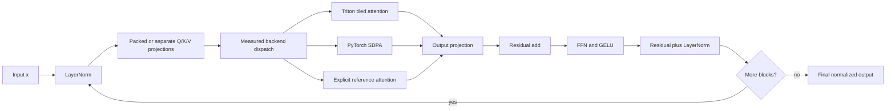

The implementation preserves the baseline submodule and parameter surface by
subclassing `BaselineTransformer`. `copy_model_weights(..., strict=True)` can
therefore copy the original weights without a state-dict adapter.

## 5. Optimization 1: projection-native layout and packed QKV

### 5.1 Before

#### Packed-QKV baseline code flow

The supplied baseline computes query, key, and value with three independent
`M → M` linear projections. Each result starts in BSM layout, is viewed as BSHD,
transposed to BHSD, and then passed through `.contiguous()` before attention.
For non-degenerate sequence/head axes this materializes a copy; a size-one axis
can make the request a no-op. The projection arithmetic is dominant, but the
usual path also pays three launch boundaries and up to three layout-copy costs.

#### Packed-QKV baseline pseudocode

```text
for projection in [q_proj, k_proj, v_proj]:
    projected_bsm = projection(x)
    viewed_bshd = view(projected_bsm, B, S, H, D)
    projected_bhsd = contiguous(transpose_sequence_and_head(viewed_bshd))

q, k, v = the three projected_bhsd tensors
```

`projected_bsm`, `viewed_bshd`, and `projected_bhsd` are descriptive variable
names for the BSM, BSHD, and BHSD layouts defined in Section 3.4.

#### Packed-QKV baseline source excerpt

The baseline code performs that sequence directly
([`benchmarks/torch_transformer_benchmark.py`, lines 77–95](../benchmarks/torch_transformer_benchmark.py#L77-L95)):

```python
def _split_heads(self, x: torch.Tensor) -> torch.Tensor:
    batch, seq_len, _ = x.shape
    return (
        x.view(batch, seq_len, self.num_heads, self.head_dim)
        .transpose(1, 2)
        .contiguous()
    )

# ... inside BaselineSelfAttention.forward(...)
q = self._split_heads(self.q_proj(x))
k = self._split_heads(self.k_proj(x))
v = self._split_heads(self.v_proj(x))
```

#### Packed-QKV baseline code-flow diagram

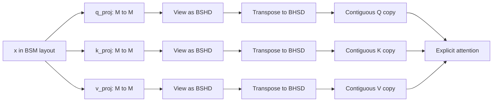

#### Packed-QKV baseline Big-O and scaling

| Before quantity | Derivation | Tight bound and scaling |
| --- | --- | --- |
| Three projection matrix multiplications | `3 × B × S × M × M` | `Θ(3 B S M²) = Θ(B S M²)`. Doubling `B` or `S` doubles this work; doubling `M` makes it about 4× larger. |
| Up to three contiguous layout copies | `3 × B × S × H × D = 3 B S M` elements | `Θ(B S M)` when copies are required. Doubling `B`, `S`, or `M` doubles the copied elements. |
| Q/K/V activation storage | `3 × B × S × H × D` elements | `Θ(B S M)`. |
| Projection launch count | Three independent linear calls | Constant with respect to tensor size, but launch overhead matters on short or narrow workloads. |

The transpose itself is a constant-time view operation. When the transposed
strides are not already contiguous, `.contiguous()` materializes the reordered
tensor, so that copy is not `Θ(1)`.

### 5.2 After

#### Packed-QKV optimized code flow

The baseline calls `q_proj`, `k_proj`, and `v_proj` separately and reshapes each
result. The optimized path, when all guards pass, concatenates the three
existing weights and biases into derived non-persistent tensors, runs one
`F.linear`, and views the result as `[B, S, 3, H, D]`:

#### Packed-QKV optimized pseudocode

```text
if packed_projection_is_not_supported(x, model_state):
    return separate Q, K, and V projections as BSHD views

signature = parameter pointers, versions, devices, and dtypes
if cache is missing or signature changed:
    packed_weight = concatenate(q_weight, k_weight, v_weight)
    packed_bias = concatenate(q_bias, k_bias, v_bias)
    cache = signature, packed_weight, packed_bias

projected = linear(x, cache.packed_weight, cache.packed_bias)
q, k, v = unbind(view(projected, B, S, 3, H, D), projection_axis)
```

#### Packed-QKV optimized source excerpt

This is the guarded implementation, including the exact fallback and cache
invalidation check
([`transformer_opt/submission.py`, lines 165–198](../transformer_opt/submission.py#L165-L198)):

```python
use_packed = (
    x.is_cuda
    and x.dtype == torch.float32
    and not torch.is_grad_enabled()
    and not is_compiling
    and (attn.d_model <= 512 or attn.d_model == 1024)
)
if not use_packed:
    split = lambda tensor: tensor.view(
        batch, seq_len, num_heads, head_dim
    )
    return (
        split(attn.q_proj(x)),
        split(attn.k_proj(x)),
        split(attn.v_proj(x)),
    )

signature = self._qkv_signature(attn)
cached = self._packed_qkv_cache.get(id(attn))
if cached is None or cached[0] != signature:
    packed_weight = torch.cat(
        (attn.q_proj.weight, attn.k_proj.weight, attn.v_proj.weight),
        dim=0,
    ).detach()
    packed_bias = torch.cat(
        (attn.q_proj.bias, attn.k_proj.bias, attn.v_proj.bias),
        dim=0,
    ).detach()
    cached = (signature, packed_weight, packed_bias)
    self._packed_qkv_cache[id(attn)] = cached

projected = F.linear(x, cached[1], cached[2])
qkv = projected.view(batch, seq_len, 3, num_heads, head_dim)
return qkv.unbind(dim=2)
```

The cache signature includes data pointers, tensor version counters, devices,
and dtypes. An in-place parameter update or device/dtype move rebuilds the
derived tensors. The cache is deliberately disabled for CPU, low precision,
gradient-enabled execution, compilation, and unmeasured widths 513–1023. It is
enabled for measured eager CUDA float32 `d_model <= 512` and exact
`d_model == 1024`. Calling `.train()` alone does not disable packing inside
`torch.inference_mode()`; this derived cache follows gradient state, not the
module's training flag.

#### Packed-QKV optimized code-flow diagram

The first decision checks whether packed projection is supported. A cache miss
rebuilds the derived packed weight; a cache hit proceeds directly to the single
linear operation. Both branches finish in the same BSHD tensor layout.

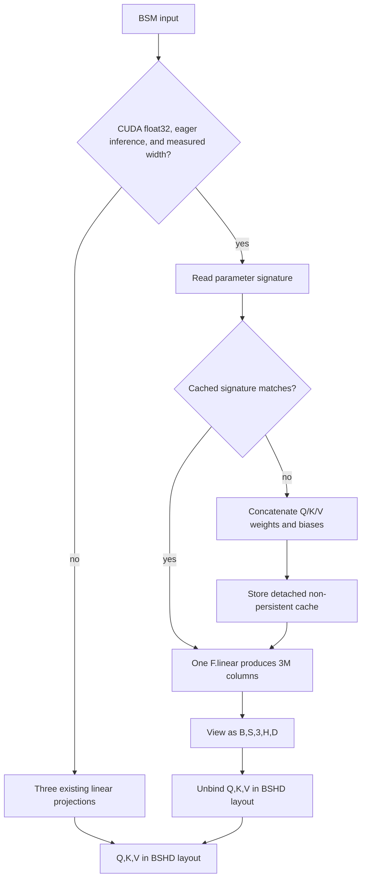

#### Packed-QKV optimized Big-O and scaling

| After quantity | Derivation | Tight bound and scaling |
| --- | --- | --- |
| Packed projection on a cache hit | One `M → 3M` multiplication: `B × S × M × 3M` | `Θ(3 B S M²) = Θ(B S M²)`, the same arithmetic order and coefficient as three `M → M` products. |
| Cache rebuild | Concatenate three `M × M` weights and three length-`M` biases | `Θ(3 M² + 3M) = Θ(M²)` time and derived storage per layer. It is paid only on a miss, not every steady-state forward. |
| View and unbind | Metadata-only views of one packed result | `Θ(1)` metadata work; Q/K/V activation storage remains `Θ(B S M)`. |
| Custom-path layout conversion | The Triton kernel consumes BSHD directly | No BHSD contiguous copy on this path. Reference and SDPA fallbacks may still transpose for their own contracts. |
| Projection launch count | One packed vendor linear call after the cache is ready | Three projection launches become one; this is a constant-factor change, not an asymptotic one. |

At fixed `M`, changing how `M = H × D` is split into heads does not change the
projection bound. Doubling `B` or `S` still doubles projection work; doubling
`M` still makes it about 4× larger and also makes the derived cache about 4×
larger.

### 5.3 Theoretical result

Packed QKV and projection-native BSHD layout do **not** improve the projection's
Big-O order. Their theoretical benefit is lower constant overhead:

- one vendor projection launch instead of three on eligible steady-state
  forwards;
- no requested BHSD materialization before the custom BSHD attention kernel
  when those baseline `.contiguous()` calls would require copies; and
- reuse of one derived packed weight until a parameter, device, or dtype change
  invalidates it.

The theoretical cost is `Θ(M²)` additional derived-weight storage per layer and
the same `Θ(M²)` concatenation work on a cache miss. This is why the guard remains
limited to measured widths and no-gradient execution states.

### 5.4 Empirical result

The exact-width `d_model=1024` row-8 profile is the clean projection evidence.
It compares the same shape over ten forwards:

| Metric | Separate projections | Packed QKV | Change |
| --- | ---: | ---: | ---: |
| `aten::addmm` calls | 240 | 160 | −33.33% |
| `addmm` device time | 106,065.035 µs | 94,048.315 µs | −11.33% |
| Model device time | 150,050.615 µs | 138,182.163 µs | −7.91% |

The comparison is documented by the [Campaign 6 baseline profile](../docs/results/rtx-5070-ti-2026-08-29-c6-baseline-row08-profile-c.json)
and [integrated profile](../docs/results/rtx-5070-ti-2026-08-29-c6-integrated-row08-profile.json).
Attention correctly remains on explicit reference math for this row; the
profile proves projection work reduction, not Triton attention execution.

The trade-off is derived-weight memory. The measured four-layer width-1024 row
adds 50,380,800 bytes before the forward (about 48 MiB). The boundary test keeps
width 768 and all widths 513–1023 on separate projections because no evidence
authorizes the broader guard.

## 6. Optimization 2: tiled attention with online softmax and in-kernel masks

### 6.1 Before

#### Dense-attention baseline code flow

The supplied attention computes every query-key score into a global BHSS tensor,
applies causal and valid-key masks to that tensor, creates another global BHSS
probability tensor with softmax, and finally multiplies those probabilities by
`V`. The method is mathematically direct, but both square intermediates grow
with `S²`.

#### Dense-attention baseline pseudocode

```text
scores = (Q @ transpose(K)) * scale

if causal:
    causal_mask = allocate S by S future-position mask
    scores = replace disallowed future scores with negative infinity

if valid_token_mask exists:
    scores = replace invalid-key scores with negative infinity

P = softmax(scores in fp32)
context = P @ V
```

#### Dense-attention baseline source excerpt

The baseline materializes `scores` and `probs` explicitly
([`benchmarks/torch_transformer_benchmark.py`, lines 97–112](../benchmarks/torch_transformer_benchmark.py#L97-L112)):

```python
scores = torch.matmul(q, k.transpose(-2, -1)) * self.scale

if causal:
    causal_mask = torch.ones(
        (seq_len, seq_len), device=x.device, dtype=torch.bool
    ).triu(diagonal=1)
    scores = scores.masked_fill(causal_mask, float("-inf"))

if valid_token_mask is not None:
    # Mask invalid key positions. Shape: [B, 1, 1, S].
    invalid_keys = ~valid_token_mask[:, None, None, :]
    scores = scores.masked_fill(invalid_keys, float("-inf"))

probs = torch.softmax(scores.float(), dim=-1).to(dtype=x.dtype)
context = torch.matmul(probs, v)
```

#### Dense-attention baseline code-flow diagram

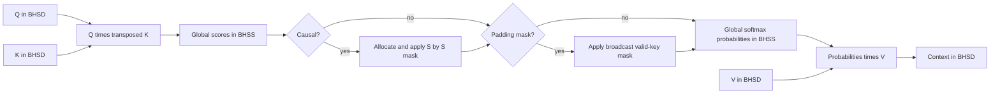

#### Dense-attention baseline Big-O and scaling

| Before quantity | Derivation | Tight bound and scaling |
| --- | --- | --- |
| `Q Kᵀ` multiplication | `B × H × S × S × D` | `Θ(B H S² D) = Θ(B S² M)`. |
| `P V` multiplication | `B × H × S × S × D` | `Θ(B H S² D) = Θ(B S² M)`. |
| Score scaling, masks, and softmax | Touch up to `B × H × S × S` values | `Θ(B H S²)`. |
| Global scores and probabilities | Two tensors of `B × H × S × S` elements | `Θ(B H S²)` attention-intermediate storage. |
| Dense causal mask | `S × S` Boolean values before broadcasting | `Θ(S²)` additional storage when created. |

Combining the two matrix multiplications gives `Θ(B S² M)` attention time.
At fixed `B`, `H`, `D`, and dtype, doubling `S` makes both arithmetic and dense
attention-intermediate storage about 4× larger. Doubling `B` or `H` doubles the
BHSS intermediates; doubling `D` at fixed `H` doubles the matrix-multiply work
but not the number of score elements.

### 6.2 After

#### Tiled-attention optimized code flow

For each query tile, the kernel streams K/V tiles. It stores only:

```text
m:     running maximum per query row
ell:   running softmax normalization sum per query row
a:     running weighted-value accumulator per query row and feature
```

For a new score tile `s`, let `m_new` be the maximum of the old running maximum
and the tile maximum. The update is:

```text
alpha   = exp(m_old - m_new)
p       = exp(s - m_new)
ell_new = alpha * ell_old + sum(p)
a_new   = alpha * a_old + p @ V_tile
```

The final context is `a_new / ell_new`, with an explicit zero result for an
all-masked row. The implementation uses fp32 running state, converts the score
rounding boundaries to match the reference, and uses IEEE fp32 dot products for
causal custom attention after strict-stack testing exposed rare TF32 misses.

Causal `key <= query` bounds and valid-key prefix masks are combined in the
score tile. The kernel masks invalid loads and stores only the real head width.

#### Tiled-attention optimized pseudocode

```text
for each query tile:
    m = negative infinity for every query row
    ell = 0 for every query row
    a = 0 for every query row and head feature

    for each K/V tile:
        s = scaled Q_tile @ transpose(K_tile)
        s = apply in-bounds, valid-key, and causal conditions

        m_new = max(m, row_max(s))
        alpha = exp(m - m_new)
        p = exp(s - m_new) for allowed entries, otherwise 0
        ell = alpha * ell + row_sum(p)
        a = alpha * a + p @ V_tile
        m = m_new

    context_tile = a / ell when ell > 0, otherwise 0
    store context_tile
```

#### Tiled-attention optimized source excerpt

The kernel's running state and update are visible in the implementation
([`transformer_opt/kernels/attention.py`, lines 89–178](../transformer_opt/kernels/attention.py#L89-L178)).
The `# ...` lines below are the marked omissions described in Section 3.4:

```python
running_max = tl.full((BLOCK_M,), -float("inf"), tl.float32)
running_sum = tl.zeros((BLOCK_M,), tl.float32)
accumulator = tl.zeros((BLOCK_M, DOT_HEAD_DIM), tl.float32)

for start_n in range(0, N_CTX, BLOCK_N):
    # ... load the bounded K and V tile ...
    allowed = key_valid[None, :]
    if CAUSAL:
        allowed = allowed & (offs_n[None, :] <= offs_m[:, None])

    # ... compute and scale the QK score tile ...
    scores = tl.where(allowed, scores, -float("inf"))
    block_max = tl.max(scores, axis=1)
    new_max = tl.maximum(running_max, block_max)
    # ... choose safe_max for an all-masked tile ...
    alpha = tl.where(
        running_max != -float("inf"),
        tl.exp2(running_max - safe_max),
        0.0,
    )
    probabilities = tl.where(
        allowed,
        tl.exp2(scores - safe_max[:, None]),
        0.0,
    )

    accumulator *= alpha[:, None]
    # ... accumulate probabilities @ V using the selected dot precision ...
    running_sum = running_sum * alpha + tl.sum(probabilities, axis=1)
    running_max = tl.where(has_value, new_max, running_max)

normalized = accumulator / tl.where(
    running_sum[:, None] > 0, running_sum[:, None], 1.0
)
normalized = tl.where(running_sum[:, None] > 0, normalized, 0.0)
```

In the source, `running_max`, `running_sum`, and `accumulator` correspond to
the report's `m`, `ell`, and `a`. `N_CTX` is the concrete sequence length `S`,
and `DOT_HEAD_DIM` is the internal dot width; for `D=8` it is padded to 16 while
`HEAD_DIM` and the output remain the real width.

#### Tiled-attention optimized code-flow diagram

The loop visits one key/value tile at a time. The running maximum,
normalization sum, and weighted-value accumulator carry the state needed to
combine the next tile without storing a full score matrix.

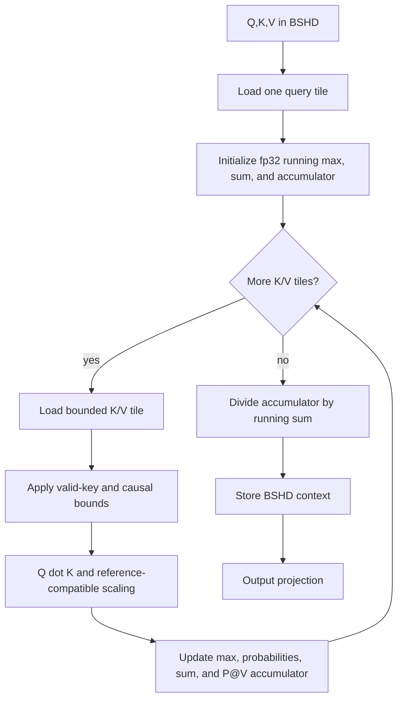

#### Tiled-attention optimized Big-O and scaling

There are `B × H × ceil(S / BLOCK_M)` query-tile programs. Each program visits
`ceil(S / BLOCK_N)` key/value tiles, and a tile interaction performs work
proportional to `BLOCK_M × BLOCK_N × D`. Multiplying those terms and ignoring
edge-tile padding gives:

```text
B H × ceil(S / BLOCK_M)
    × ceil(S / BLOCK_N)
    × BLOCK_M × BLOCK_N × D
= Θ(B H S² D)
= Θ(B S² M)
```

The custom path therefore retains quadratic attention arithmetic. Its storage
changes because no global BHSS scores or probabilities are written:

| After quantity | Tight bound and scaling |
| --- | --- |
| Global Q/K/V/context tensors | `Θ(B H S D) = Θ(B S M)`. Doubling `S` makes this component about 2× larger. |
| Per-program query and accumulator state | `Θ(BLOCK_M × D)`. |
| Per-program streamed K/V tile | `Θ(BLOCK_N × D)` for each loaded tensor. |
| Per-program running maximum and sum | `Θ(BLOCK_M)`. |
| Attention arithmetic | `Θ(B S² M)`. Doubling `S` still makes the dominant work about 4× larger. |

`BLOCK_M` and `BLOCK_N` are fixed launch constants for a compiled kernel, so
tile scratch does not grow as `S × S`. More programs and loop iterations cover a
longer sequence instead.

The custom support envelope is CUDA inference, sequence length at most 8,192,
head dimension in `{8, 16, 32, 64, 128}`, final feature stride one, and float16
or float32. The measured short-sequence launch policies include:

The custom support envelope is CUDA inference, sequence length at most 8,192,
head dimension in `{8, 16, 32, 64, 128}`, final feature stride one, and float16
or float32. The measured short-sequence launch policies include:

| Head dimension / sequence | `BLOCK_M × BLOCK_N` | Warps | Reason |
| --- | ---: | ---: | --- |
| `D=8`, `S<=128` | `64×64` | 4 | Internal dot width is padded to 16 lanes; selected for final row 11. |
| `D=32`, `S<=128` | `64×64` | 4 | Lower K/V-tile pressure for narrow heads. |
| `D=64`, `S<=128` | `32×64` | 4 | Reduces register/shared-memory pressure for causal IEEE fp32 dots. |
| `D=128`, `S<=128` | `32×32` | 4 | Smaller K/V tile for short wide-head attention. |
| `D<=64`, longer sequences | `64×64` or `64×128` | 4 | Sequence-aware policy; stages increase for longer contexts. |
| Wider measured heads | `32×64` | 4 | Conservative shared-memory footprint. |

The `D=8` path pads only the internal reduction lanes and stores only the real
eight output lanes. The scale remains `8**-0.5`, not the padded width's scale.

### 6.3 Theoretical result

Online-softmax tiling changes the custom path's global
attention-intermediate storage from `Θ(B H S²)` to linear Q/K/V/context storage
`Θ(B H S D) = Θ(B S M)` plus fixed tile scratch. It also combines score
generation, masks, softmax, and `P @ V` inside one kernel instead of handing
global score and probability tensors between operations.

It does **not** make exact dense self-attention subquadratic: time remains
`Θ(B S² M)` because every allowed query-key interaction is still evaluated.
Consequently, the 100,000-token case remains an authorized resource skip; lower
intermediate storage does not make its compute demand practical under the
recorded contract.

### 6.4 Empirical result

The following measurements isolate launch or custom-attention decisions. They
are not all the same timing protocol, so each scope is stated explicitly:

| Experiment | Before | After | Outcome |
| --- | ---: | ---: | --- |
| Final row-10 target profile, `_attention_fwd` over 40 launches | 30,324.486 µs | 2,694.679 µs | −91.11%; the selected short `D=64` tile reduced spills from 2,468 registers to two and shared memory from 81,920 to 49,152 bytes. |
| Short `D=32` row-1 candidate screen | 1.2402 ms | 0.8201 ms | Selected `64×64` over the previous policy; three-run alternating comparison. |
| Short `D=128` row-9 candidate screen | 1.2341 ms fresh baseline | 0.9042 ms | −26.73%; selected `32×32` over larger alternatives and production SDPA. |
| Final row-11 `D=8` candidate screen | Reference route | 1.0595 / 1.0628 / 1.0624 ms selected medians | Selected `64×64`; candidate was 81.08% below the fresh reference timing in the Campaign 4 screen. |
| Current final row 13, `B=64,S=1024,M=128,H=4,D=32` | 88.8280 ms | 18.5412 ms | 4.791× end-to-end speedup with custom Triton attention. |

The clearest before/after storage measurement is the held-out
`B=1,S=1024,M=512,H=8,L=2` long-attention case:

| Memory metric | Before baseline | After SpeedROCm | Outcome |
| --- | ---: | ---: | ---: |
| Incremental peak allocation | 81,788,928 bytes (78 MiB) | 23,068,672 bytes (22 MiB) | −71.79% |

That case also moved from 0.8077 ms to 0.5148 ms, a 1.569× end-to-end speedup.
The latency includes the full model; the allocation reduction is the direct
measurement that matches the theoretical removal of global BHSS attention
intermediates. The source is the
[held-out artifact](../docs/results/rtx-5070-ti-2026-08-29-c11-integrated-heldout-5seed.json).

The final-row timing is combined end-to-end evidence; the profiler rows are the
causal evidence that the custom kernel actually ran. The current final artifact
records the row-13 numbers and the aggregate backend accounting.

## 7. Optimization 3: shape-aware launch and backend routing

### 7.1 Before

#### Fixed-routing baseline code flow

The supplied baseline has no backend-selection layer. Once Q/K/V are available,
every input follows the same explicit PyTorch sequence: materialize scores,
apply masks, run softmax, and multiply by `V`. That path is the correctness
reference, but it cannot exploit a faster validated kernel for one shape or
avoid an inaccurate approximate route for another because no alternative route
exists.

#### Fixed-routing baseline pseudocode

```text
q, k, v = separate projections in BHSD layout
scores = explicit Q @ transpose(K)
scores = apply scale, causal mask, and valid-key mask
probabilities = explicit softmax(scores)
context = explicit probabilities @ V
return output projection of context
```

#### Fixed-routing baseline source excerpt

There is no dispatch condition around the reference operations
([`benchmarks/torch_transformer_benchmark.py`, lines 93–118](../benchmarks/torch_transformer_benchmark.py#L93-L118)):

```python
q = self._split_heads(self.q_proj(x))
k = self._split_heads(self.k_proj(x))
v = self._split_heads(self.v_proj(x))

scores = torch.matmul(q, k.transpose(-2, -1)) * self.scale

# ... apply causal and valid-key masks ...
probs = torch.softmax(scores.float(), dim=-1).to(dtype=x.dtype)
context = torch.matmul(probs, v)
context = (
    context.transpose(1, 2)
    .contiguous()
    .view(batch, seq_len, self.d_model)
)
output = self.out_proj(context)
```

#### Fixed-routing baseline code-flow diagram

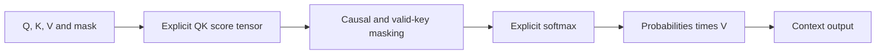

#### Fixed-routing baseline Big-O and scaling

The baseline has no dispatch work, so its attention bound is simply the explicit
backend's bound for every layer:

| Before quantity | Tight bound and scaling |
| --- | --- |
| Attention time per layer | `Θ(B S² M)`; doubling `S` makes the dominant work about 4× larger. |
| Dense attention intermediates per layer | `Θ(B H S²)`; doubling `S` makes them about 4× larger. |
| `L`-layer attention time | `Θ(L B S² M)`. |
| Backend choices | One fixed explicit path; there is no selection overhead and no shape-specific alternative. |

### 7.2 After

#### Shape-aware routing code flow

A single backend was not safe for every shape. The strict comparator is
zero-failure and multi-layer rounding differences can accumulate even when a
primitive attention test looks correct. The dispatcher therefore separates:

- **Triton:** tested CUDA inference cases with supported layout/dtype/head width
  and measured accuracy/performance evidence;
- **SDPA:** measured short unmasked float32 shapes where it is faster, and the
  exact project-held-out two-layer causal `B=2,S=512,M=512,H=8,D=64` route
  where it removed a prior regression; and
- **reference:** low precision automatic model execution, unsupported head
  widths, causal batches above 128, unmeasured neighboring shapes, and
  layer-prefix portions of exact final rows that failed full approximate
  execution.

The dispatcher records the actual selected backend. In forced `triton` mode,
unsupported inputs raise an error; they are not silently routed elsewhere.

#### Shape-aware routing pseudocode

```text
selected_backend = requested_backend

if requested_backend is auto and input is CUDA:
    if low precision or unsupported/sensitive shape:
        selected_backend = reference
    else if exact measured long-causal held-out shape:
        selected_backend = sdpa
    else if exact measured hybrid row:
        selected_backend = reference or auto according to layer index
    else if deep measured route:
        selected_backend = sdpa
    else:
        selected_backend = auto

validate the selected backend's support contract
if a forced Triton request is unsupported:
    raise a clear error

run Triton, SDPA, or explicit reference attention
record the backend that actually executed
```

#### Shape-aware routing source excerpt

The model-level policy keeps the numerically sensitive row-6 split exact and
records the returned backend
([`transformer_opt/submission.py`, lines 266–302](../transformer_opt/submission.py#L266-L302)):

```python
elif (
    attn.d_model == 128
    and attn.num_heads == 4
    and batch == 10000
    and seq_len == 128
    and self.config.num_layers == 4
    and causal
):
    # ... rationale from the measured strict comparisons ...
    selected_backend = "reference" if layer_index < 2 else "auto"
elif causal and batch > 128:
    selected_backend = "reference"
elif self.config.num_layers >= 6 and (causal or batch > 8):
    selected_backend = "sdpa"
context, dispatch = attention_forward(
    q,
    k,
    v,
    valid_token_mask,
    causal=causal,
    scale=attn.scale,
    backend=selected_backend,
)
if not is_compiling:
    self.attention_backend_counts[dispatch.selected] += 1
```

The generic dispatcher fails closed for a forced unsupported Triton request,
then selects only a supported automatic route
([`transformer_opt/dispatch.py`, lines 109–160](../transformer_opt/dispatch.py#L109-L160)):

```python
_validate_backend(backend)
support = triton_attention_support(q, k, v, valid_token_mask)
triton_ready = triton_available()
triton_preferred = support.supported and prefer_triton_attention(
    q,
    valid_token_mask,
    causal,
)

if backend == "triton":
    if not triton_ready:
        raise RuntimeError("Triton attention was forced but Triton/CUDA is unavailable")
    if not support.supported:
        raise ValueError(f"Triton attention was forced but unsupported: {support.reason}")
    # ... execute Triton and return selected="triton" ...

if backend == "auto" and triton_ready and triton_preferred:
    # ... execute Triton and return selected="triton" ...

if backend == "reference" or (backend == "auto" and q.dtype is torch.bfloat16):
    output = _reference_attention(q, k, v, valid_token_mask, causal, scale)
    return output, AttentionDispatch(backend, "reference", reason)

# ... otherwise execute SDPA and return selected="sdpa" ...
```

Here, `support` is the structured support-envelope result, `triton_ready` states
whether Triton and CUDA are available, `triton_preferred` is the measured
automatic preference, and `AttentionDispatch(requested, selected, reason)`
records what the caller asked for, what ran, and why.

#### Shape-aware routing code-flow diagram

The forced-backend branch either runs exactly what was requested or raises a
clear error. The automatic branch chooses only among measured Triton, SDPA, and
reference routes, then records the backend that actually executed.

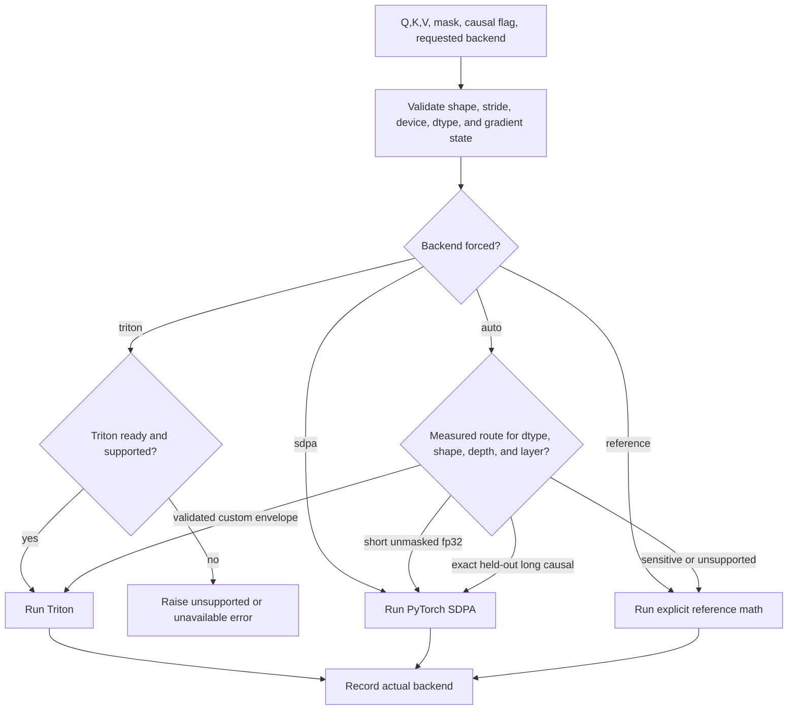

The model-level exact-row policies are intentionally narrow:

| Input condition | Auto route |
| --- | --- |
| Six-layer or deeper causal/large-batch cases outside measured exact rows | SDPA when the measured route passed; this avoids rare custom-stack misses. |
| Final row 6 (`B=10000,S=128,M=128,H=4,D=32,L=4,causal=true`) | Reference layers 0–1, Triton layers 2–3. |
| Final row 7 (`B=64,S=128,M=32,H=4,D=8,L=4,causal=true`) | Reference layer 0, Triton layers 1–3. |
| Final row 11 (`B=64,S=128,M=128,H=16,D=8,L=4,causal=true`) | Triton in all four layers, with internal `D=8` padding. |
| Low precision automatic model path | Explicit reference attention for correctness-first behavior. |
| Unsupported head width or causal batch above 128 | Explicit reference attention. |

#### Shape-aware routing Big-O and scaling

The route checks compare a fixed number of shape, dtype, device, execution-mode,
and layer-index fields. They are `Θ(1)` per layer and `Θ(L)` over the model,
which is lower order than the selected attention backend.

| Selected after route | Attention time | Global attention-intermediate storage | Sequence scaling |
| --- | --- | --- | --- |
| Triton online softmax | `Θ(B S² M)` | `Θ(B S M)` plus fixed tile scratch | About 4× time and 2× global storage when `S` doubles at fixed other dimensions. |
| Explicit reference | `Θ(B S² M)` | `Θ(B H S²)` | About 4× time and dense attention storage when `S` doubles. |
| PyTorch SDPA | Exact attention remains `Θ(B S² M)` | Backend/kernel/version dependent; this report does not assign an unsupported storage guarantee | Measured for named shapes only. |

Because the reference fallback remains part of SpeedROCm, the dispatcher's
worst-case storage is still `Θ(B H S²)`. The linear-storage claim applies to the
custom Triton route, not to every possible dispatch result. The dispatcher
changes which validated constant factors and storage implementation apply; it
does not change the Transformer contract.

### 7.3 Theoretical result

Shape-aware routing has no universal asymptotic speedup. Its theoretical value
is conditional selection:

- choose the custom route when its lower global intermediate storage and measured
  launch behavior are valid;
- choose SDPA when a measured shape is faster or more stable there;
- choose explicit reference math when strict multi-layer accuracy or support
  constraints outweigh performance; and
- fail clearly when a caller forces an unsupported custom route.

Thus the expected gain is avoiding a known slow or invalid choice, while the
cost is `Θ(1)` policy work per layer. No route is described as fastest for all
inputs.

### 7.4 Empirical result

The rejected full routes define the accepted boundaries:

| Candidate input | Correctness result | Decision |
| --- | --- | --- |
| Final row 7, four Triton layers | 1 failed element / 1,310,720 | Reject; first-layer reference hybrid passed. |
| Final row 6, four Triton layers | 21 failed elements / 819,200,000 | Reject; two reference + two Triton layers passed. |
| Final row 6, one reference + three Triton layers | 1 failed element / 819,200,000 | Reject; keep two exact layers. |
| Held-out `B=2,S=512,M=512,H=8,D=64,L=2,causal=true` with Triton | Slower than the explicit baseline in the original screen | Route to SDPA after strict correctness passed. |
| Held-out long-causal SDPA | Zero failed elements | Retained; dedicated current run measured 1.198×. |

The accepted hybrid structure is:

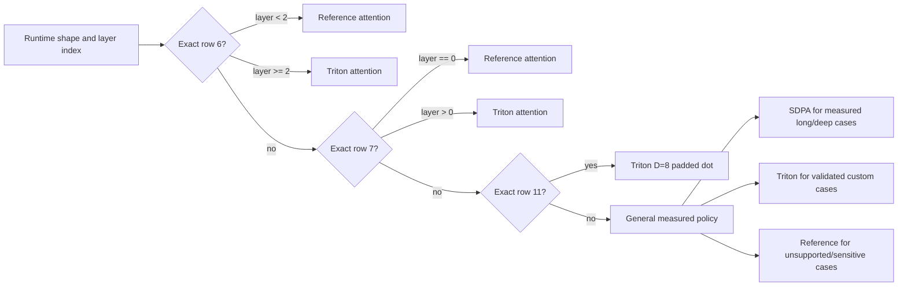

The measurable before/after outcomes are:

| Input | Before or rejected route | Accepted after route | Baseline median | Optimized median | Outcome |
| --- | --- | --- | ---: | ---: | --- |
| Final row 6 | Four Triton layers failed 21 / 819,200,000 elements; one reference + three Triton failed one | Two reference + two Triton layers, plus the separately measured residual/norm fusion | 445.1712 ms | 332.4715 ms | 1.339× end-to-end; accepted route had zero failed elements. |
| Final row 7 | Four Triton layers failed 1 / 1,310,720 elements | One reference + three Triton layers | 1.4340 ms | 0.9723 ms | 1.475× end-to-end; accepted route had zero failed elements. |
| Held-out long-causal | Original Triton route regressed latency | Exact two-layer SDPA route | 0.680800 ms | 0.568256 ms | 1.198× dedicated run, 620 SDPA calls, zero failed elements. |

Rows 6 and 7 are complete-model measurements and include other active
optimizations, so they prove the accepted route works in the integrated model
rather than isolating routing cost. Across the final published matrix, all 13
executable rows passed with zero failed elements; this is the correctness result
that the route boundaries were designed to preserve.

## 8. Optimization 4: fused residual addition plus LayerNorm

### 8.1 Before

#### Separate residual-and-norm baseline code flow

In the supplied pre-LayerNorm block, an attention or FFN update is first added
to the residual stream. A later native LayerNorm call reads that stored residual
again to produce the normalized input for the next sublayer. These are separate
framework operations with separate GPU launch and global-memory handoff points.

#### Separate residual-and-norm baseline pseudocode

```text
update = attention_or_ffn(normalized_input)
residual = x + update
store residual

normalized = LayerNorm(load residual)
use normalized as the next attention or FFN input
```

#### Separate residual-and-norm baseline source excerpt

The two residual additions and their consuming norms are visible in the
baseline block
([`benchmarks/torch_transformer_benchmark.py`, lines 134–145](../benchmarks/torch_transformer_benchmark.py#L134-L145)):

```python
def forward(
    self,
    x: torch.Tensor,
    valid_token_mask: Optional[torch.Tensor],
    causal: bool,
) -> torch.Tensor:
    x = x + self.attention(self.norm1(x), valid_token_mask, causal)
    x = x + self.ffn_out(F.gelu(self.ffn_in(self.norm2(x)), approximate="none"))

    if valid_token_mask is not None:
        x = x.masked_fill(~valid_token_mask[..., None], 0)
    return x
```

In the first assignment, `norm1(x)` precedes attention and the resulting
residual is consumed by `norm2(x)` in the next assignment. The second residual
is consumed by the next block's `norm1` or by `final_norm`.

#### Separate residual-and-norm baseline code-flow diagram

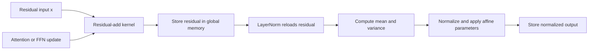

#### Separate residual-and-norm baseline Big-O and scaling

| Before quantity | Derivation | Tight bound and scaling |
| --- | --- | --- |
| Residual add | Read and add `B × S × M` elements | `Θ(B S M)`. |
| LayerNorm | Mean, variance, normalization, and affine work over `B × S` rows of width `M` | `Θ(B S M)`. |
| Combined pair | Sum of two linear passes | `Θ(B S M)`; adding two terms with the same order does not change the order. |
| Main activation transfers, simplified | Add reads `x` and `update` and writes residual; LayerNorm reads residual and writes normalized output | Approximately `5 × B × S × M` element transfers, excluding affine parameters, implementation-specific extra passes, and cache effects. |
| Launches and outputs | At least one add operation plus one LayerNorm operation; residual and normalized tensors remain live as required | Two operation boundaries and `Θ(B S M)` output storage. |

Doubling `B`, `S`, or `M` doubles the elementwise work and the simplified
activation traffic for this pair.

### 8.2 After

#### Fused residual-and-norm code flow

For exact final rows 5, 6, 9, and 11, under eval-mode eager CUDA float32
inference, the model fuses the residual add with the LayerNorm that immediately
consumes it. A single Triton program:

1. loads `x` and the update;
2. computes `residual = x + update` in fp32;
3. optionally zeros invalid rows;
4. computes row mean and variance;
5. applies epsilon, affine weight, and bias; and
6. stores both the residual and normalized result.

The initial input norm remains native. A four-layer fused route therefore has
eight fused calls per forward and one remaining native initial norm. The route
is disabled for training, gradients, compilation, CPU, other dtypes,
non-contiguous masks, neighboring runtime shapes, and unsupported configurations.

#### Fused residual-and-norm pseudocode

```text
if exact measured fusion guard passes:
    residual = x + update in fp32
    if requested, zero an invalid residual row
    store residual

    mean = average(residual across M features)
    variance = average((residual - mean) squared across M features)
    normalized = (residual - mean) / square_root(variance + epsilon)
    normalized = normalized * affine_weight + optional_affine_bias
    if requested, zero an invalid normalized row
    store normalized
else:
    run the original separate residual add and native LayerNorm path
```

#### Fused residual-and-norm source excerpt

The fused kernel keeps the newly computed residual in program state while it
computes LayerNorm, then stores both outputs
([`transformer_opt/kernels/residual_layer_norm.py`, lines 44–75](../transformer_opt/kernels/residual_layer_norm.py#L44-L75)):

```python
x = tl.load(x_ptr + offsets, mask=in_bounds, other=0.0).to(tl.float32)
update = tl.load(
    update_ptr + offsets,
    mask=in_bounds,
    other=0.0,
).to(tl.float32)
residual = x + update

row_valid = True
if HAS_VALID_MASK:
    row_valid = tl.load(valid_mask_ptr + row)
if ZERO_INVALID_RESIDUAL:
    residual = tl.where(row_valid, residual, 0.0)

tl.store(residual_out_ptr + offsets, residual, mask=in_bounds)

mean = tl.sum(residual, axis=0) / N_COLS
centered = tl.where(in_bounds, residual - mean, 0.0)
variance = tl.sum(centered * centered, axis=0) / N_COLS
normalized = centered * tl.rsqrt(variance + eps)
weight = tl.load(weight_ptr + columns, mask=in_bounds, other=0.0).to(
    tl.float32
)
normalized *= weight
if HAS_BIAS:
    bias = tl.load(bias_ptr + columns, mask=in_bounds, other=0.0).to(
        tl.float32
    )
    normalized += bias
if ZERO_INVALID_NORMALIZED:
    normalized = tl.where(row_valid, normalized, 0.0)
tl.store(normalized_out_ptr + offsets, normalized, mask=in_bounds)
```

The model consumes both outputs without changing the original parameter surface
([`transformer_opt/submission.py`, lines 439–463](../transformer_opt/submission.py#L439-L463)):

```python
x, ffn_input = self._fused_residual_norm(
    x,
    attn_out,
    layer.norm2,
    valid_token_mask,
)
# ... compute ffn_out and choose the next LayerNorm module ...
x, normalized = self._fused_residual_norm(
    x,
    ffn_out,
    next_norm,
    valid_token_mask,
    zero_invalid_residual=valid_token_mask is not None,
    zero_invalid_normalized=is_last and valid_token_mask is not None,
)
```

In the kernel excerpt, `N_COLS = M`, `row` identifies one of the `B × S` token
rows, and `columns` indexes model-width features. `HAS_BIAS`,
`HAS_VALID_MASK`, `ZERO_INVALID_RESIDUAL`, and
`ZERO_INVALID_NORMALIZED` are compile-time Boolean flags. The two output
pointers receive the residual tensor and its normalized form.

The exact shape and execution-state guard is
[`_use_fused_residual_layer_norm`](../transformer_opt/submission.py#L332-L394).
Unsupported calls retain the baseline path; the low-level wrapper also validates
device, dtype, shape, contiguity, gradient state, mask, affine parameters, and
feature width before launching.

#### Fused residual-and-norm code-flow diagram

The guard is intentionally narrow. Supported rows use one kernel to produce
both the residual and normalized output; every other input follows the separate
PyTorch residual-add and LayerNorm path.

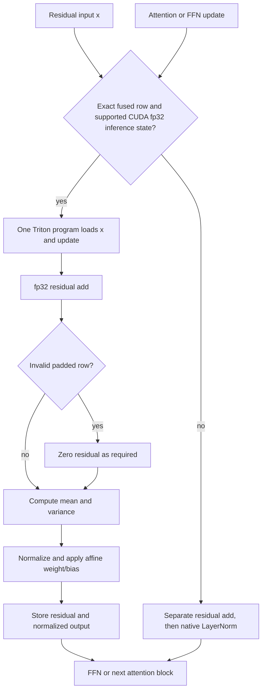

#### Fused residual-and-norm Big-O and scaling

| After quantity | Derivation | Tight bound and scaling |
| --- | --- | --- |
| Fused residual and LayerNorm | One program processes each BSM row element and performs the same row reductions | `Θ(B S M)`, unchanged from before. |
| Main activation transfers, simplified | Read `x` and `update` once, then write residual and normalized outputs | Approximately `4 × B × S × M` element transfers, excluding affine parameters and cache effects. |
| Launches and outputs | One fused launch; both residual and normalized outputs are still stored because later computation needs both | One operation boundary and `Θ(B S M)` output storage. |
| Guard | Fixed comparisons over shape, dtype, device, mode, mask, and configuration | `Θ(1)` per forward. |

Under the simplified traffic model, the main activation transfers fall from
five to four per element, a theoretical 20% reduction for this pair. This is
not a promise of 20% model latency: LayerNorm reductions, affine reads, cache
behavior, attention, projections, and the FFN remain. Doubling `B`, `S`, or `M`
still doubles this fused elementwise work.

### 8.3 Theoretical result

Fusion preserves `Θ(B S M)` time and `Θ(B S M)` output storage. Its benefit is
one fewer operation boundary and elimination of the global-memory reload of the
new residual before LayerNorm. It cannot eliminate the residual output itself,
because the next residual addition still needs it.

The expected gain is largest when residual/normalization launches and memory
traffic are a meaningful part of the shape's runtime. The narrow exact-row
guard reflects that this constant-factor benefit and numerical behavior were
measured only for rows 5, 6, 9, and 11 under eager CUDA float32 inference.

### 8.4 Empirical result

#### Profile attribution

The profile comparisons below are subsystem measurements. They are more
diagnostic than a single top-level profiler range because profiler snapshots
can contain outliers; the row-9 top-level snapshot was explicitly treated as
noisy and the causal latency decision used counterbalanced CUDA-event runs.

| Exact shape | Profile window | Separate residual/norm | Fused residual/norm | Subsystem change | Kernel counts after fusion |
| --- | ---: | ---: | ---: | ---: | --- |
| Row 5: `B=128,S=128,M=128,H=4,D=32,L=4` | 30 forwards | 12,089.646 µs | 7,016.653 µs | −41.96% | 240 fused, 30 native norms |
| Row 6: `B=10000,S=128,M=128,H=4,D=32,L=4` | 10 forwards | 486,023.333 µs | 317,375.671 µs | −34.70% | 80 fused, 10 native norms |
| Row 9: `B=64,S=128,M=128,H=1,D=128,L=4` | paired profile mean | 5,765.324 µs | 3,357.389 µs | −41.77% | 240 fused, 30 native norms |
| Row 11: `B=64,S=128,M=128,H=16,D=8,L=4` | 30 forwards | 5,978.920 µs | 3,220.674 µs | −46.13% | 240 fused, 30 native norms |

For row 6, the same profile also moved model device time from 2,026,089.666 µs
to 1,884,493.452 µs (−6.99%). For row 11, it moved model device time from
41,211.814 µs to 32,109.116 µs (−22.09%). The row-5 and row-9 top-level
profiler ranges were noisy, so they are not used as standalone end-to-end speed
claims.

The row-specific profiler artifacts are:

- [row-5 baseline](../docs/results/rtx-5070-ti-2026-08-29-c10-baseline-row05-profile.json)
  and [row-5 integrated](../docs/results/rtx-5070-ti-2026-08-29-c11-integrated-row05-profile.json);
- [row-6 baseline](../docs/results/rtx-5070-ti-2026-08-29-c7-baseline-row06-profile.json)
  and [row-6 integrated](../docs/results/rtx-5070-ti-2026-08-29-c11-integrated-row06-profile.json);
- [row-9 baseline recheck](../docs/results/rtx-5070-ti-2026-08-29-c11-baseline-row09-profile-recheck.json),
  [row-9 integrated](../docs/results/rtx-5070-ti-2026-08-29-c11-integrated-row09-profile.json),
  and [row-9 confirmation](../docs/results/rtx-5070-ti-2026-08-29-c11-integrated-row09-profile-confirmation.json); and
- [row-11 baseline](../docs/results/rtx-5070-ti-2026-08-29-c8-baseline-row11-profile-e.json)
  and [row-11 integrated](../docs/results/rtx-5070-ti-2026-08-29-c11-integrated-row11-profile.json).

#### Dedicated before/after latency gates

Longer CUDA-event runs provide the most stable timing comparison for the fused
rows:

| Shape | Baseline median | Optimized median | Speedup | Samples | Accuracy |
| --- | ---: | ---: | ---: | ---: | --- |
| Row 5 | 2.186832 ms | 1.163168 ms | 1.880× | 300 | 0 failed / 10,485,760 |
| Row 6 | 291.417252 ms | 188.457397 ms | 1.546× | 100 | 0 failed / 819,200,000 |
| Row 9 | 0.825328 ms | 0.717648 ms | 1.150× | 300 | 0 failed / 5,242,880 |
| Row 11 | 4.195168 ms | 0.890672 ms | 4.710× | 300 | 0 failed / 5,242,880 |

For the row-9 campaign decision specifically, two unchanged controls averaged
0.815968 ms optimized latency while the active fused candidate measured
0.717648 ms, a controlled **12.05%** reduction. The isolated candidate measured
0.717696 ms, only 0.007% from the active transplant.

These rows combine attention, projections, FFN, and normalization in the
end-to-end measurement. The profile table is the attribution evidence for the
fusion itself; the dedicated run is the latency decision evidence.

## 9. Benchmark method and formulas

### 9.1 Recorded environment

| Component | Recorded value |
| --- | --- |
| CPU | AMD Ryzen 7 9850X3D, 8 cores / 16 logical processors |
| GPU | NVIDIA GeForce RTX 5070 Ti, compute capability 12.0, 16,303 MiB |
| Driver | 616.56 |
| OS | Windows 11, build 26200, AMD64 |
| Python | CPython 3.12.10 |
| PyTorch | 2.13.0+cu130 |
| CUDA runtime | 13.0 |
| Triton | 3.7.1 / `triton-windows==3.7.1.post27` |
| Matmul policy | PyTorch high precision, TF32 enabled for the measured non-causal path |

### 9.2 Timing protocol

For each case:

1. construct the baseline and optimized models with identical weights;
2. generate deterministic inputs from the case seed, input scale, and padding
   ratio;
3. run correctness before timing;
4. warm up both models;
5. measure synchronized CUDA-event samples;
6. alternate baseline and optimized order across rounds; and
7. record raw samples, medians, means, p90, throughput, memory, backend counts,
   environment, Git metadata, and the implementation fingerprint.

First-use compilation, random input generation, and model construction are
excluded from steady-state forward latency. Accuracy and timing inputs are kept
separate.

For each case `i`, the report uses:

```text
speedup_i = median(baseline_ms_i) / median(optimized_ms_i)

latency_reduction_i = 1 - median(optimized_ms_i) / median(baseline_ms_i)

geomean_speedup = exp((1 / n) × Σ ln(speedup_i))
```

For case `i`, `baseline_ms_i` and `optimized_ms_i` are that case's median
baseline and optimized latencies in milliseconds. `speedup_i` is their ratio,
`latency_reduction_i` is the fractional latency decrease, and `n` is the number
of executable cases included in the aggregate. Skipped cases are not included
in `n`.

The geometric mean prevents a single large-batch row from dominating the
aggregate. The primary final artifact uses warmup 3, 10 timing repeats, two
alternating rounds, five accuracy trials, `atol=0.001`, `rtol=0.01`, float32,
and no padding because the organizer's final table omits those policies. The
project-held-out artifact uses warmup 10, 30 repeats, three rounds, five
accuracy trials, and includes padding cases.

## 10. Final published-shape before/after results

All rows in this table use the final artifact's primary median timing. The route
column describes the optimized model's attention route; `fused residual/norm`
describes the separate exact-row optimization. Every executable row passed with
zero failed elements.

| Row | B | S | M (model width) | H (heads) | L | Baseline median | Optimized median | Speedup | Optimized route |
| ---: | ---: | ---: | ---: | ---: | ---: | ---: | ---: | ---: | --- |
| 1 | 64 | 128 | 128 | 4 | 4 | 1.3778 ms | 0.8152 ms | 1.690× | Triton |
| 2 | 1 | 128 | 128 | 4 | 4 | 1.4685 ms | 0.8804 ms | 1.668× | Triton |
| 3 | 4 | 128 | 128 | 4 | 4 | 1.4305 ms | 0.7830 ms | 1.827× | Triton |
| 4 | 16 | 128 | 128 | 4 | 4 | 1.3367 ms | 0.7560 ms | 1.768× | Triton |
| 5 | 128 | 128 | 128 | 4 | 4 | 2.9495 ms | 1.2745 ms | 2.314× | Triton + fused residual/norm |
| 6 | 10,000 | 128 | 128 | 4 | 4 | 445.1712 ms | 332.4715 ms | 1.339× | 2 reference + 2 Triton layers + fused residual/norm |
| 7 | 64 | 128 | 32 | 4 | 4 | 1.4340 ms | 0.9723 ms | 1.475× | 1 reference + 3 Triton layers |
| 8 | 64 | 128 | 1,024 | 4 | 4 | 15.0661 ms | 13.7354 ms | 1.097× | Reference attention + packed QKV |
| 9 | 64 | 128 | 128 | 1 | 4 | 1.3186 ms | 0.7409 ms | 1.780× | Triton + fused residual/norm |
| 10 | 64 | 128 | 128 | 2 | 4 | 1.4622 ms | 0.9257 ms | 1.579× | Triton |
| 11 | 64 | 128 | 128 | 16 | 4 | 5.7496 ms | 0.9017 ms | 6.377× | Triton + fused residual/norm |
| 12 | 64 | 32 | 128 | 4 | 4 | 1.4426 ms | 0.8002 ms | 1.803× | Triton |
| 13 | 64 | 1,024 | 128 | 4 | 4 | 88.8280 ms | 18.5412 ms | 4.791× | Triton |
| 14 | 32 | 100,000 | 1,024 | 16 | 2 | not executed | not executed | not counted | Authorized resource skip |

The final primary result summary is 13 executable passes, one authorized skip,
zero failed elements, and 1.977420× geometric-mean speedup. The complete
confirmation is 1.986499× with identical correctness and aggregate backend
counts.

### 10.1 Final-matrix plot

The following Mermaid chart uses the exact primary per-row speedups above.

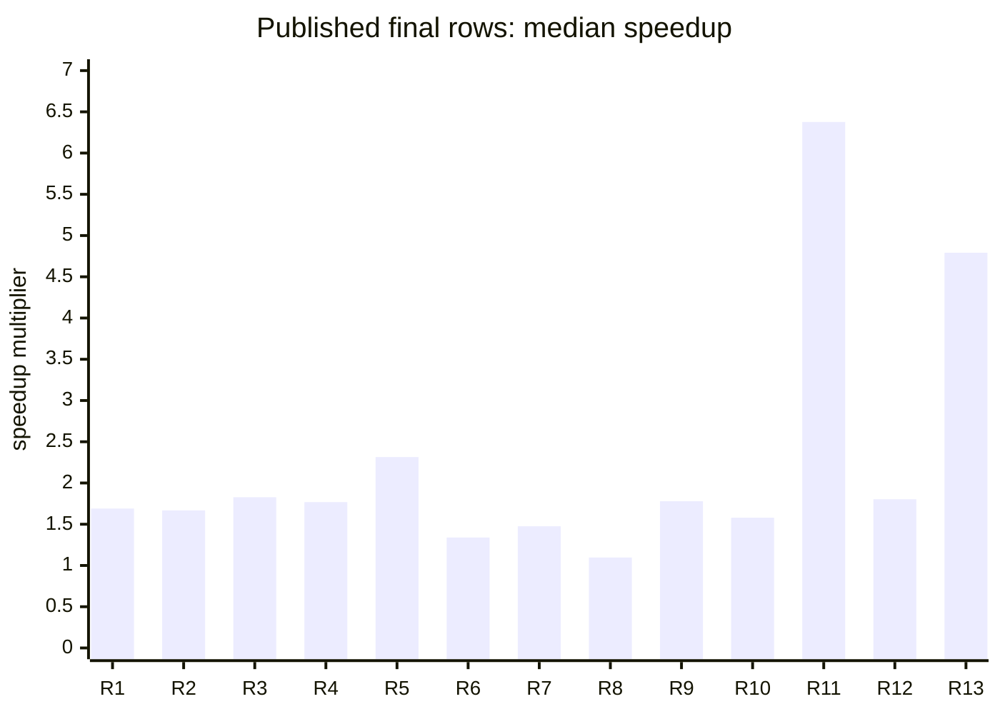

Rows 6–8 are intentionally conservative. Their attention routes do not all
use Triton, but they still improve end-to-end latency through the accepted
hybrid, projection, or surrounding optimizations while preserving the strict
contract.

`R1` through `R13` are rows 1 through 13 in the table. A bar above `1` means
the optimized median was faster; a bar at `1` would mean equal latency.

## 11. Different inputs tested and outcomes

### 11.1 Untouched organizer default

The unchanged organizer PyTorch script was run with only
`UserOptimizedTransformer` injected:

| Metric | Baseline | Optimized |
| --- | ---: | ---: |
| Median latency | 1.8687 ms | 1.3495 ms |
| Mean latency | 2.1607 ms | 1.3988 ms |
| P90 latency | 2.8291 ms | 1.5648 ms |
| Throughput | 547,983 tokens/s | 758,797 tokens/s |

The six-layer `B=8,S=128,M=512,H=8,D=64,F=2048,L=6` default passed 5/5
accuracy trials with 0 failed elements across 2,621,440 comparisons. All 1,950
optimized attention calls used Triton.

Evidence: [`c11-integrated-organizer-default.json`](../docs/results/rtx-5070-ti-2026-08-29-c11-integrated-organizer-default.json).

### 11.2 Project-owned held-out matrix

The held-out matrix tests different shapes from the published final table,
including non-causal, padding, longer sequence, and width-1024 inputs. Each
case ran five accuracy trials and passed with zero failed elements.

| Case | B | S | M (model width) | H (heads) | L | Mask | Baseline median | Optimized median | Speedup | Incremental peak change |
| --- | ---: | ---: | ---: | ---: | ---: | --- | ---: | ---: | ---: | ---: |
| tiny-overhead | 1 | 32 | 64 | 4 | 2 | none | 0.4758 ms | 0.3126 ms | 1.522× | unchanged |
| medium-throughput | 8 | 128 | 256 | 8 | 2 | none | 0.4820 ms | 0.3276 ms | 1.471× | −26.67% |
| medium-padding | 4 | 256 | 512 | 8 | 2 | 30% prefix padding | 0.6465 ms | 0.4863 ms | 1.329× | −31.25% |
| long-causal | 2 | 512 | 512 | 8 | 2 | causal | 0.6812 ms | 0.5682 ms | 1.199× | −50.27% |
| long-causal-padding | 2 | 512 | 512 | 8 | 2 | causal + 30% padding | 0.8289 ms | 0.6757 ms | 1.227× | −54.41% |
| long-attention | 1 | 1,024 | 512 | 8 | 2 | none | 0.8077 ms | 0.5148 ms | 1.569× | −71.79% |
| wide-model | 2 | 128 | 1,024 | 16 | 1 | none | 0.2344 ms | 0.2077 ms | 1.128× | unchanged |

The primary held-out matrix was **7/7 PASS** at 1.339847× geometric mean; the
complete confirmation was **7/7 PASS** at 1.386495×. The dedicated current
long-causal run measured 0.680800 ms → 0.568256 ms, or 1.198×, with 620 SDPA
calls and zero failed elements.

Evidence: [`c11-integrated-heldout-5seed.json`](../docs/results/rtx-5070-ti-2026-08-29-c11-integrated-heldout-5seed.json),
[`c11-integrated-heldout-5seed-confirmation.json`](../docs/results/rtx-5070-ti-2026-08-29-c11-integrated-heldout-5seed-confirmation.json),
and [`c11-integrated-long-causal-long.json`](../docs/results/rtx-5070-ti-2026-08-29-c11-integrated-long-causal-long.json).

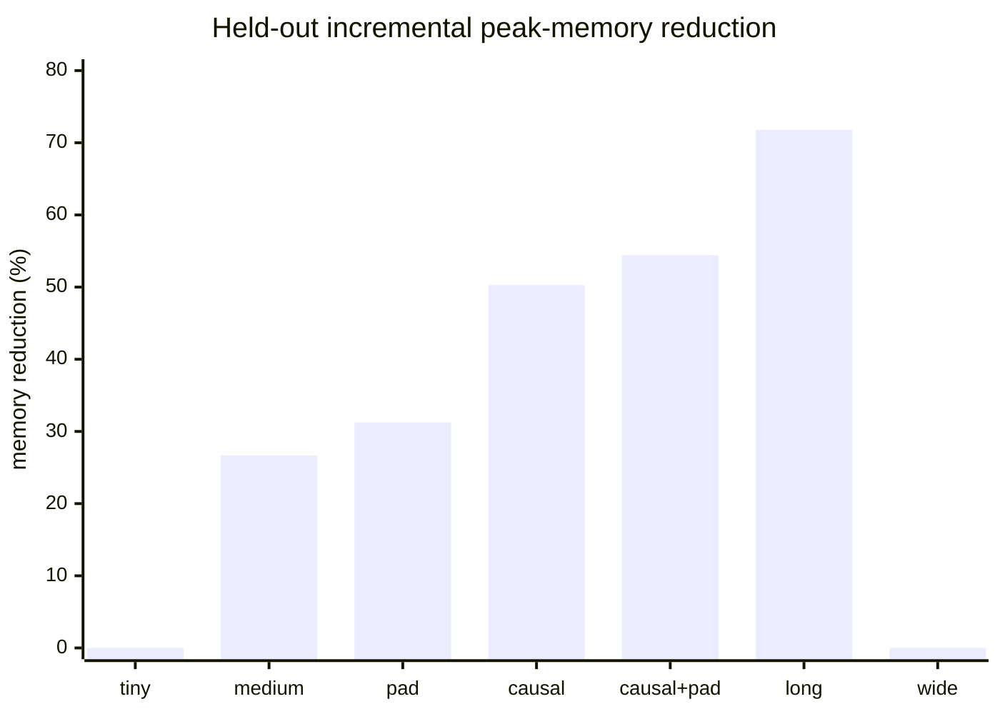

Higher bars mean a larger reduction in incremental peak allocation; zero means
the measured incremental peak was unchanged. The short labels match the case
names in the table immediately above.

The long-attention reduction is the clearest memory result: incremental peak
allocation falls from 81,788,928 bytes (78 MiB) to 23,068,672 bytes (22 MiB), a
71.79% reduction. This is the direct effect of avoiding global score and
probability tensors; it does not claim a reduction in asymptotic attention
arithmetic.

### 11.3 Supplied-contract source-derived matrix

The isolated source-derived runner translated every feasible dimension signal
from the supplied PyTorch and TensorFlow benchmark files into the selected
PyTorch harness:

| Coverage | Outcome |
| --- | --- |
| Requested entries | 29 |
| Executable entries | 28 |
| Executable passes | 28/28 |
| Authorized resource skips | 1, not counted as pass |
| Accuracy trials | 140 |
| Compared elements | 459,776,000 |
| Failed elements | 0 |
| Geometric-mean speedup | 1.206505× |
| Aggregate attention dispatch | Triton 672 / SDPA 1,344 / reference 2,688 |

The matrix covers batch sizes 1, 4, 8, 16, 128, and 10,000; sequence lengths
32, 128, and 1,024; widths 32, 128, 512, and 1,024; heads 1, 2, 4, 8, and 16;
float32, float16, and bfloat16; causal and non-causal attention; and prefix
padding. Automatic low-precision cases use explicit reference math, which is a
correctness policy rather than a custom-kernel speed claim.

Evidence: [`c11-integrated-source-derived.json`](../docs/results/rtx-5070-ti-2026-08-29-c11-integrated-source-derived.json).

### 11.4 Direct, boundary, and negative-path tests

The repository test suite also exercises:

- direct Triton attention in float32 and float16;
- causal, non-causal, all-valid-mask, partial-prefix-padding, and minimum-prefix
  cases;
- strict weight copy and unchanged state-dict keys;
- QKV cache reuse, invalidation after an in-place weight update, exact width-1024
  enablement, and width-768 non-enablement;
- sequence and head-width support boundaries;
- CPU, low precision, gradients, training mode, compiled mode, non-contiguous
  masks, and neighboring runtime shapes;
- exact row-6 and row-7 hybrid route counts;
- exact row-5, row-6, row-9, and row-11 fused-call counts; and
- fail-closed benchmark artifact accounting for `PASS`, `FAIL`, `OOM`, `ERROR`,
  and authorized resource skips.

The measured Campaign 11 checkpoint recorded **148/148 tests passed** with 14
upstream PyTorch deprecation warnings. The validation-hardened maintenance tree
records **164/164 tests passed** with the same 14 warnings and current
fingerprint `a186b679...`. That maintenance proof does not relabel the immutable
Campaign 11 measurements. A CPU-only test pass is treated as semantic coverage,
not as GPU performance evidence.

## 12. Rejected alternatives and why they stayed out

The campaign retained failed and slower candidates as evidence instead of
relaxing the contract:

| Candidate | Input / evidence | Outcome |
| --- | --- | --- |
| Full Triton `D=256` attention | Row 8 primitive kernels were accurate, but four-layer variants missed 2 / 41,943,040 elements. The repaired first-layer hybrid regressed model time 8.50%; a wider tile exceeded the 101,376-byte shared-memory limit. | Rejected. |
| Full Triton or SDPA for row 6 | 21 / 819,200,000 failed elements for each full route. | Rejected; keep two exact reference layers. |
| Full Triton or SDPA for row 7 | 1 / 1,310,720 failed elements. | Rejected; keep first layer exact. |
| SDPA for row 8 attention | 1 / 41,943,040 failed elements; the profile was dominated by `addmm` work. | Rejected. |
| Width-1024 residual/LayerNorm fusion | Correct but 0.49% slower in row-8 timing; eight-warp variant was 5.58% slower. | Rejected. |
| Standalone Triton LayerNorm | Native/custom ratios were 0.511×, 0.693×, and 0.456× for the tested shapes. | Removed; the accepted fusion also removes the neighboring residual launch. |
| Unmeasured packed-QKV width guard | A broad `d_model <= 1024` condition would have enabled widths 513–1023 without evidence. | Narrowed to `d_model <= 512 or d_model == 1024`. |

These decisions explain why the final result contains reference and SDPA calls.
The goal is a fast, truthful submission under the exact comparator, not a claim
that Triton must run for every input.

## 13. Reproduction commands

From Windows PowerShell at the repository root:

The `$python` variable stores the virtual-environment Python path, `&` invokes
that path, a trailing grave accent continues the command on the next line, and
`#` begins a comment. The same notation is tabulated in the
[repository handoff](02_PUBLIC_REPOSITORY.md#powershell-notation-used-below).

```powershell
$python = ".venv\Scripts\python.exe"

# Full repository contract.
& $python -m pytest tests -q

# Untouched organizer default.
& $python benchmarks/run_organizer_torch.py --device cuda

# Published final dimensions; write disposable output under ignored results/.
& $python benchmarks/run_organizer_validation.py `
  --matrix benchmarks/final_evaluator_shapes.json `
  --out results/reproduce-final-evaluator.json

# Source-derived organizer contract.
& $python benchmarks/run_organizer_validation.py `
  --out results/reproduce-source-derived.json

# Held-out matrix.
& $python benchmarks/run_matrix.py `
  --device cuda --attention-backend auto --accuracy-trials 5 `
  --out results/reproduce-heldout.json

# Row-9 profiler proof.
& $python benchmarks/profile_cases.py `
  --manifest benchmarks/campaign11_profile_shapes.json `
  --case final-09-b64-d128-h1-s128 --dtype float32 `
  --attention-backend auto --expect-backend triton `
  --expect-fused-residual-layer-norm --steps 30 `
  --out results/reproduce-row9-profile.json
```

Do not hand-edit the curated JSON under `docs/results/`. Result artifacts are
fingerprint-bound and record the implementation identity, environment, command,
raw samples, and Git dirty state. After source, framework, driver, or hardware
changes, regenerate the affected artifact.

## 14. AI-assisted development and human contribution

The initial repository history attributes an SDPA/optional-LayerNorm prototype
to Claude Code. OpenAI Codex was used for repository-contract tracing, kernel
implementation, WSL/native Windows environment diagnosis, correctness and
negative-path tests, profiling, bounded optimization campaigns, evidence
reconciliation, and documentation.

AI output was not treated as proof. Acceptance decisions used source code,
strict tests, raw CUDA-event samples, profiler events, result artifacts, and
recorded environment metadata.

Repository evidence does not establish additional human team members. Add only
verified names and responsibilities before publishing a team submission.

## 15. Limitations and next work

- The organizer's final shape table omits dtype, padding, timing, tolerance,
  and backward policy. This report states the selected PyTorch float32/no-padding
  assumptions rather than presenting them as organizer-confirmed rules.
- The implementation is forward/inference-only. Backward kernels are outside
  the current contract.
- Launch geometry and route decisions are tuned and measured on the RTX 5070 Ti;
  another GPU may select a fallback or require fresh tuning.
- Automatic deep-stack float16/bfloat16 execution prioritizes exact reference
  math. Direct fp16 attention tests do not imply a general automatic fp16
  speedup.
- Packed QKV increases derived-weight memory and is disabled outside measured
  widths. The exact row-8 cache adds about 48 MiB before its measured forward.
- Exact residual/LayerNorm fusion is limited to rows 5, 6, 9, and 11. Adjacent
  shapes require fresh profile, correctness, memory, and fallback evidence.
- The source-authorized 100,000-token row is skipped because its explicit dense
  baseline is a resource case; it is not a claim of successful execution at that
  length.
- Public repository visibility and a public YouTube upload are external human
  gates. This report supplies evidence and a recording script, but it does not
  claim those actions are complete.

## 16. Evidence index

- Implementation contract: [`../docs/REQUIREMENTS.md`](../docs/REQUIREMENTS.md)
- Kernel algorithm: [`../docs/KERNEL_DESIGN.md`](../docs/KERNEL_DESIGN.md)
- Existing full technical narrative: [`../docs/TECH_REPORT.md`](../docs/TECH_REPORT.md)
- Campaign chronology: [`../docs/experiments/CAMPAIGN_RUN_THROUGH.md`](../docs/experiments/CAMPAIGN_RUN_THROUGH.md)
- Complete optimization history: [`../docs/experiments/OPTIMIZATION_HISTORY.md`](../docs/experiments/OPTIMIZATION_HISTORY.md)
- Final primary artifact: [`../docs/results/rtx-5070-ti-2026-08-29-c11-integrated-final.json`](../docs/results/rtx-5070-ti-2026-08-29-c11-integrated-final.json)
- Final confirmation: [`../docs/results/rtx-5070-ti-2026-08-29-c11-integrated-final-confirmation.json`](../docs/results/rtx-5070-ti-2026-08-29-c11-integrated-final-confirmation.json)
- Held-out matrix: [`../docs/results/rtx-5070-ti-2026-08-29-c11-integrated-heldout-5seed.json`](../docs/results/rtx-5070-ti-2026-08-29-c11-integrated-heldout-5seed.json)
- Source-derived matrix: [`../docs/results/rtx-5070-ti-2026-08-29-c11-integrated-source-derived.json`](../docs/results/rtx-5070-ti-2026-08-29-c11-integrated-source-derived.json)
- Organizer default: [`../docs/results/rtx-5070-ti-2026-08-29-c11-integrated-organizer-default.json`](../docs/results/rtx-5070-ti-2026-08-29-c11-integrated-organizer-default.json)
- Track 3 compliance: [`../hackathon-docs/TRACK3_COMPLIANCE.md`](../hackathon-docs/TRACK3_COMPLIANCE.md)
