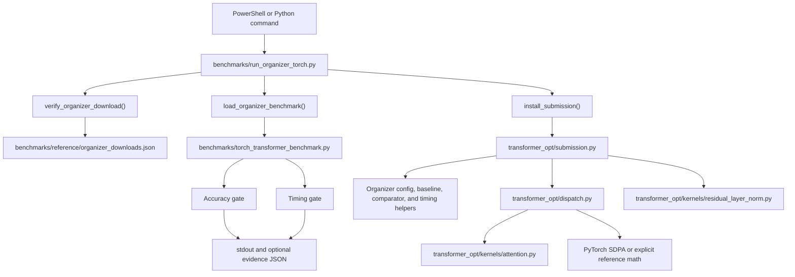
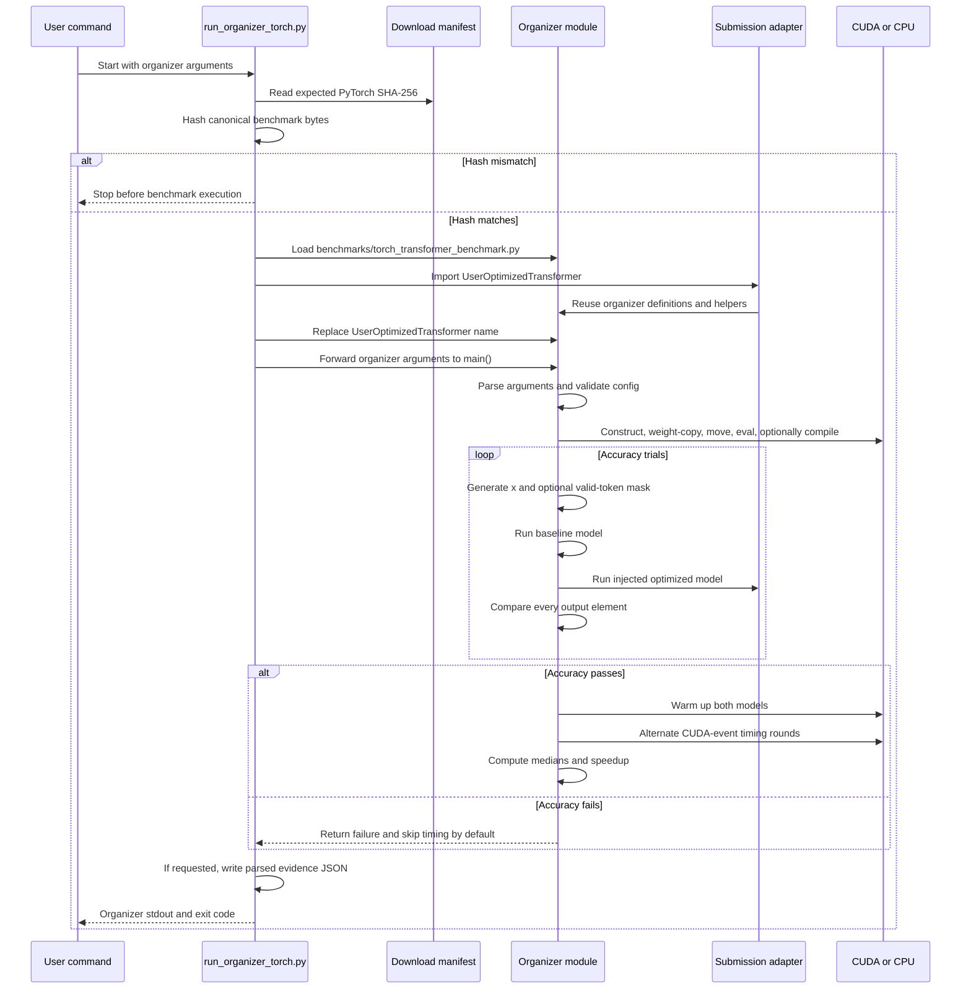
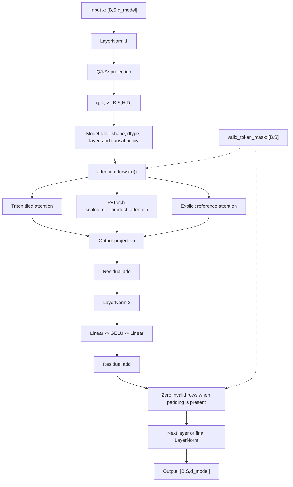
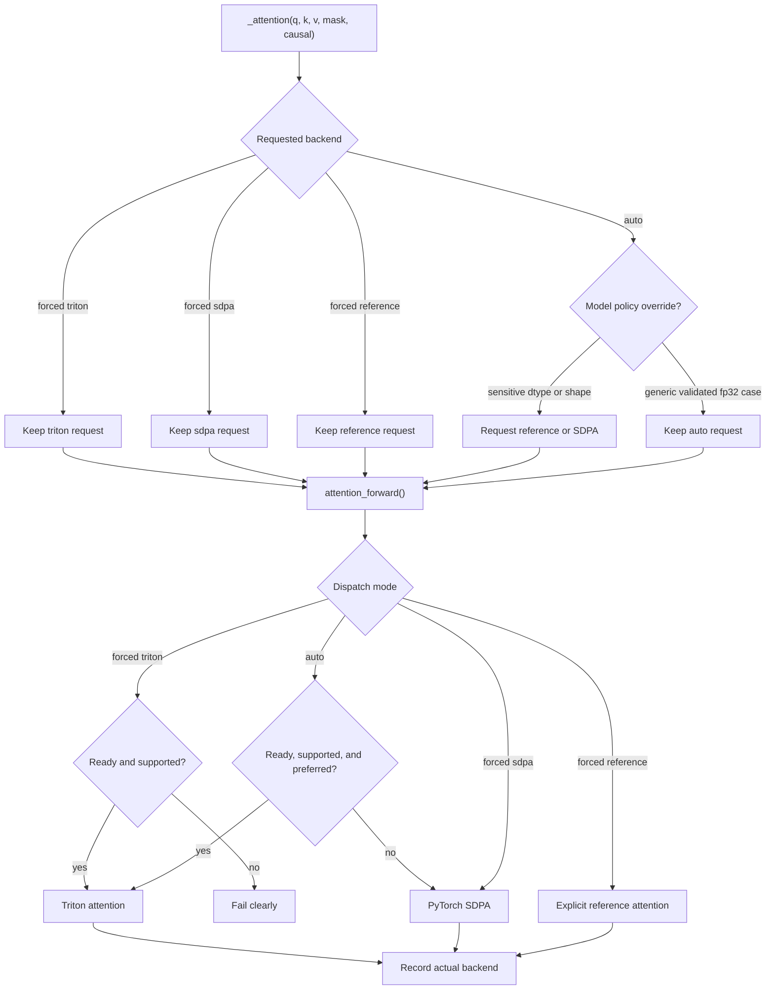
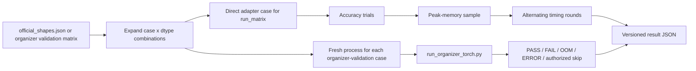
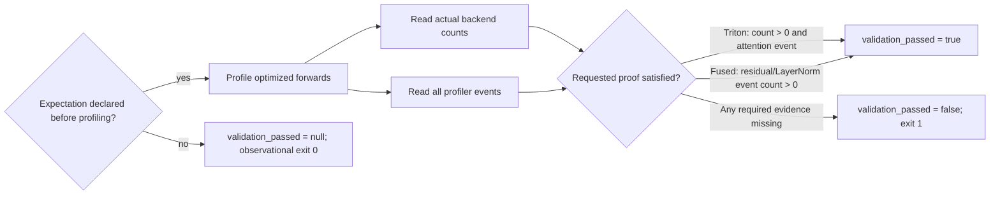

# Track 3 code flow: command to evidence

This page explains the complete PyTorch path in this repository. Track 3 has
three deliberately separate layers:

1. The organizer benchmark is the contract and remains unchanged under
   `benchmarks/torch_transformer_benchmark.py`.
2. `benchmarks/run_organizer_torch.py` is the adapter that verifies and loads
   that file, then installs the repository submission at its documented
   `UserOptimizedTransformer` extension point.
3. `transformer_opt/submission.py` is the optimized model. It reuses the
   organizer's model definitions and comparison/timing helpers while changing
   the attention and selected residual/LayerNorm operations.

The short version is:

```text
command -> verify organizer bytes -> load organizer -> inject submission
-> construct baseline and optimized models -> copy identical weights
-> run accuracy gate -> run timed comparison -> emit stdout/evidence
```

## 1. Repository-level architecture

The arrows below show imports and runtime control flow. The baseline model,
comparator, random-case generator, and timing harness are imported from the
canonical organizer module; they are not reimplemented in a second benchmark.



The TensorFlow file at
`benchmarks/tensorflow_transformer_benchmark.py` is retained as an organizer
input and shape-scope cross-check. The selected submission framework is
PyTorch, so the execution path described below starts at the PyTorch file.

## 2. What happens when the organizer runner starts

`run_organizer_torch.py` has a small responsibility boundary. It does not
copy, edit, or wrap the organizer's accuracy or timing functions.

1. The wrapper parses only its own optional `--evidence-out` argument. Every
   other argument is preserved for the organizer parser, except that an
   evidence-producing run rejects the diagnostic `--non-strict-weight-copy`
   escape hatch.
2. `verify_organizer_download()` reads the reference manifest and computes the
   raw SHA-256 of `benchmarks/torch_transformer_benchmark.py`. A mismatch stops
   the run before the benchmark executes.
3. `load_organizer_benchmark()` loads that exact path as the module name
   `benchmarks.torch_transformer_benchmark`. If that name already exists in
   `sys.modules`, its resolved `__file__` must be this canonical path or the run
   stops. This prevents a same-name module imported from elsewhere from
   contaminating an in-process run.
4. `install_submission()` imports
   `transformer_opt.submission.UserOptimizedTransformer` and assigns it to the
   organizer module's `UserOptimizedTransformer` name. This is dependency
   injection at the extension point supplied by the organizer.
5. The runner temporarily sets `sys.argv` to the organizer file followed by
   the forwarded arguments and calls `module.main()`.
6. Without `--evidence-out`, the runner returns the organizer's exit code and
   leaves the organizer's normal stdout visible.
7. With `--evidence-out`, it tees stdout to the terminal and a buffer, parses
   the accuracy/timing summary, records backend counts and environment data,
   and writes a JSON evidence record after the organizer returns.

The runner therefore changes which class is constructed, but not how the
organizer decides correctness or speed.



## 3. What the organizer `main()` does

After injection, the organizer's own `main()` controls the run from start to
finish:

1. `parse_args()` reads dimensions, dtype, device, causal mode, padding ratio,
   tolerance, seed, warmup, repeat, round, and optional compile settings.
2. `resolve_device()` and `resolve_dtype()` resolve the requested runtime.
3. `TransformerConfig.validate()` checks positive dimensions and that
   `d_model` is divisible by `heads`; it also checks that the FFN dimension and
   layer count are valid.
4. Seeds and CUDA/TF32 settings are applied.
5. `BaselineTransformer(config)` is constructed from the organizer's explicit
   pre-LayerNorm implementation. The injected
   `UserOptimizedTransformer(config)` is constructed in its place for the
   optimized side.
6. By default, `copy_model_weights(..., strict=True)` copies the baseline state
   dict into the optimized model. Because the optimized class subclasses the
   baseline and keeps the same parameter names, strict copying is expected to
   succeed. The organizer parser exposes `--non-strict-weight-copy` for
   diagnostics, but the repository runner refuses that flag whenever
   `--evidence-out` is present, so evidence-grade runs cannot weaken this gate.
7. Both models are moved to the selected device/dtype and put in evaluation
   mode. Compilation, if requested, happens only after construction, weight
   copying, device transfer, and `eval()`.
8. `run_accuracy_tests()` runs the correctness gate.
9. If every trial passes, `benchmark_models()` runs the timing gate. If any
   trial fails, timing is skipped unless `--benchmark-on-failure` was passed.
10. The process exits zero only when the accuracy gate passes. A failed
    accuracy gate returns exit code 2, even if diagnostic timing was requested.

The organizer's default contract is not the same thing as every project
matrix setting. `run_organizer_validation.py` explicitly passes each case's
dtype, padding, tolerance, seed, and timing values to this same entry point;
`run_matrix.py` is a separate direct adapter runner with its own case loop.
There is also a discrepancy inside the untouched organizer file: its module
docstring says 0.001/0.01, but its parser actually defaults to `atol=0.002` and
`rtol=0.02`. Repository evidence matrices pass the stricter 0.001/0.01 values
explicitly rather than relying on either description.

## 4. The baseline and optimized model forward paths

Both models implement the same mathematical Transformer:

```text
for each layer:
    x = x + attention(layer.norm1(x))
    x = x + layer.ffn_out(GELU(layer.ffn_in(layer.norm2(x))))
x = final_norm(x)
```

The input is `[B, S, d_model]`. Each attention projection is reshaped to
`[B, S, H, D]`, where `D = d_model / H`. An optional boolean mask has shape
`[B, S]`; it marks valid prefix tokens. Invalid rows are zeroed after each
block and after the final normalization so padding has the same observable
behavior in both models.



### Baseline path

The organizer baseline uses three linear projections, transposes to
`[B,H,S,D]`, materializes the score tensor, applies causal and valid-key
masks, computes fp32 softmax, multiplies probabilities by V, and applies the
output projection. It is intentionally explicit so it is a stable correctness
reference.

### Optimized path

`UserOptimizedTransformer` inherits the baseline module structure. Its changes
are guarded and local:

- In eligible eager CUDA float32 inference, `_project_qkv()` concatenates the
  existing Q/K/V weights and biases, performs one `F.linear`, and views the
  result as Q/K/V without changing state-dict keys. The derived packed tensors
  are cached and invalidated when a source parameter's pointer, mutation
  version, device, or dtype changes.
- `_attention()` retains `[B,S,H,D]` views and chooses a requested backend from
  the model's accuracy/performance policy. It then calls
  `attention_forward()` and records the actual selected backend.
- The FFN remains PyTorch `Linear -> GELU(approximate="none") -> Linear`.
- On exact final rows 5, 6, 9, and 11, a narrower eligibility check can use
  the fused residual-plus-LayerNorm Triton kernel. That route is limited to
  eager CUDA float32 inference with supported layouts and exact shapes. All
  neighboring or unsupported situations use the original two PyTorch
  operations.

The optimized implementation is therefore not a replacement Transformer
formula. It is the same formula with selected projection, attention, and
residual/normalization execution paths replaced under explicit guards.

## 5. The two-stage attention backend decision

There are two decisions, not one:

1. `UserOptimizedTransformer._attention()` applies model-level policy. In
   `auto` mode it can request exact reference math for sensitive dtypes,
   unsupported head widths, and unmeasured causal batch sizes; request SDPA
   for measured deep-stack or long-causal cases; or leave the request as
   `auto` for the generic custom-kernel envelope. Forced `triton`, `sdpa`, and
   `reference` requests are preserved.
2. `transformer_opt.dispatch.attention_forward()` validates the Q/K/V contract
   and resolves the requested backend. It checks CUDA availability, dtype,
   head dimension, sequence length, strides, mask shape, inference status, and
   device capability before allowing Triton. In `auto`, supported and
   preferred cases use Triton; other cases use SDPA, while explicit/reference
   sensitive cases use the reference implementation.



The low-level support envelope is in `transformer_opt/config.py`: CUDA
forward-inference tensors, float16/float32, head dimensions in
`{8, 16, 32, 64, 128}`, sequence length at most 8192, a unit-stride final head
dimension, and a suitable compute capability. A forced unsupported Triton
request fails clearly; `auto` is allowed to fall back.

## 6. What the Triton attention kernel does

`transformer_opt/kernels/attention.py` launches a two-dimensional grid:

```text
(ceil_div(sequence, BLOCK_M), batch * heads)
```

Each program loads a query tile and visits key/value tiles. It keeps the
running maximum, running exponential sum, and weighted-value accumulator in
fp32. It applies valid-token and causal bounds before the online softmax and
never materializes a `[B,H,S,S]` score or probability tensor. The wrapper
selects fixed launch geometry from `attention_launch_config()`; it does not
autotune during the benchmark.

The width-eight path uses an internal compile-time dot width of 16, masks the
extra lanes, and stores only the real eight features. This works around the
Triton reduction-width constraint without changing the public shape or scale.

The fallback implementations are intentional correctness controls:

- SDPA receives `[B,H,S,D]`, builds a boolean valid/causal mask when needed,
  calls PyTorch's scaled dot-product attention, and returns to `[B,S,H,D]`.
- Reference attention follows the organizer's explicit score, mask, fp32
  softmax, and P@V sequence.

## 7. Accuracy gate: how a result becomes PASS

The organizer random-case generator creates deterministic inputs from the
seed. With padding, it creates a prefix-valid boolean mask and zeros the input
padding. For each trial, the harness runs both models under
`torch.inference_mode()` and calls `compare_outputs()`.

For every output element, the comparison accepts the candidate when either

```text
absolute_error <= atol
OR
absolute_error <= rtol * abs(reference)
```

Non-finite values, shape mismatches, and any element satisfying neither rule
are failures. The report aggregates failed elements, total elements, maximum
absolute/relative error, mean absolute error, the worst index, and failed
feature dimensions. The organizer's accuracy summary is PASS only when the
failed-element count is zero across all trials.

This gate is deliberately before timing. A faster output that is numerically
wrong is not a successful Track 3 result.

## 8. Timing gate: how speedup is measured

Only after accuracy passes, the organizer creates one fixed timing input using
the seed offset `+100000`. Random-data generation is outside the timed region.

1. Both models are warmed up, then CUDA is synchronized.
2. Each `benchmark_once()` records a CUDA event before and after every model
   call on CUDA, synchronizes after the batch, and converts elapsed events to
   milliseconds. CPU runs use `perf_counter_ns()`.
3. The harness alternates baseline-first and optimized-first order across
   benchmark rounds to reduce order and clock bias.
4. It reports median, mean, p90, minimum, and tokens/second for each model.
5. The headline speedup is

   ```text
   baseline median latency / optimized median latency
   ```

The direct organizer runner prints these values. When `--evidence-out` is
used, the runner also stores the parsed timing, organizer arguments, source
hash, backend counts, environment, and captured stdout in JSON.

## 9. How the other runners fit around the harness

The repository has several entry points because they answer different
questions:

| Entry point | Question it answers | How it relates to the organizer |
| --- | --- | --- |
| `pytest tests -q` | Do the local contracts, dispatch rules, kernels, and end-to-end model tests pass? | Imports the same adapter and canonical organizer definitions; it is the developer gate. |
| `benchmarks/run_organizer_torch.py` | Does the selected submission pass the untouched PyTorch organizer contract and timing harness? | Directly injects the submission and delegates `main()`, accuracy, and timing. |
| `benchmarks/run_organizer_validation.py` | Does the submission pass the supplied PyTorch contract matrix and translated TensorFlow shape scope? | Expands the matrix, starts a fresh child process per case, invokes the direct runner, and classifies PASS/FAIL/OOM/ERROR or the exact authorized resource skip. |
| `benchmarks/run_matrix.py` | How does the adapter behave across the project-owned manifest, dtypes, masks, and forced backends? | Calls the adapter directly, runs accuracy then timing, records memory/backend counts, and fails closed on exceptions. |
| `benchmarks/profile_cases.py` | Did an explicitly expected attention backend or fused residual/LayerNorm kernel actually execute? | Calls the adapter directly after warmup. `--expect-backend triton` requires both a positive Triton dispatch count and an attention-kernel profiler event; `--expect-fused-residual-layer-norm` independently requires the fused profiler event. Forced non-auto backends become expectations automatically. |

The matrix runner's per-case path is:



`run_organizer_validation.py` requires more than a zero exit code for a case
to be PASS: it checks the parsed accuracy status, baseline and optimized
timings, speedup, and a nonempty set of actual backend counts. This prevents
an incomplete child process or missing backend accounting from being mistaken
for a full benchmark result. It does **not** prove custom execution: a complete
reference-only or SDPA-only case can legitimately pass. Custom/fused proof is
the profiler's separate, predeclared expectation gate.



When `benchmarks/run_optimization_attempt.py` wraps a schema-2 profile, it uses
`validation_passed` for the attempt's profile status and carries the backend,
fusion, and expectation details into the summary. An unrelated attention event
can no longer turn a failed declared expectation into `metrics.status: PASS`;
a schema-2 run with no expectation remains `INCONCLUSIVE`.

## 10. A practical tracing sequence

From the repository root in PowerShell:

```powershell
$python = ".venv\Scripts\python.exe"

# 1. Check the local contracts.
& $python -m pytest tests -q

# 2. Run the untouched organizer harness with the submission injected.
& $python benchmarks/run_organizer_torch.py `
  --device cuda `
  --atol 0.001 `
  --rtol 0.01 `
  --evidence-out results/manual-organizer-evidence.json

# 3. See a single project-owned case and its selected backend.
& $python benchmarks/run_matrix.py `
  --device cuda `
  --case tiny-overhead `
  --dtype float32 `
  --attention-backend auto `
  --accuracy-trials 3 `
  --quick `
  --out results/manual-matrix.json

# 4. Prove a custom kernel with the profiler.
& $python benchmarks/profile_cases.py `
  --case long-attention `
  --dtype float32 `
  --attention-backend auto `
  --expect-backend triton `
  --steps 5 `
  --out results/manual-profile.json `
  --trace results/manual-profile-trace.json
```

For a line-by-line implementation map, use the links in the [repository
layout](../README.md#repository-layout), [requirements](REQUIREMENTS.md), and
[kernel design](KERNEL_DESIGN.md). The important invariant is that a benchmark
number is meaningful only when its organizer source hash, submission
fingerprint, accuracy result, timing protocol, and actual backend evidence are
known together.
