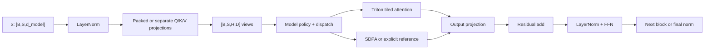
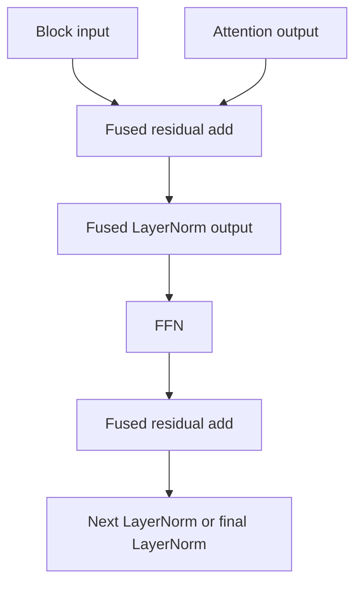

# Triton Attention Kernel Design

## Purpose

`transformer_opt/kernels/attention.py` implements the repository-owned forward
scaled dot-product attention kernel. It replaces the reference sequence of QK
matmul, score tensor, softmax, and P@V matmul with one tiled launch.
`transformer_opt/kernels/residual_layer_norm.py` additionally fuses the residual
add and downstream LayerNorm for exact final rows 5, 6, 9, and 11. Projection and FFN math
remains in PyTorch/cuBLAS; measured eager-fp32 shapes through `d_model=512` and
exact `d_model=1024` combine the three Q/K/V projections into one vendor GEMM.

At runtime, the model keeps the benchmark's ordinary Transformer structure and
only replaces eligible inner operations. The high-level route is:



For exact final rows 5, 6, 9, and 11, the guarded residual path combines the
residual add with the LayerNorm that immediately consumes it:



The guards are part of the design, not an afterthought: neighboring shapes,
CPU, low precision, gradients, noncontiguous masks, training mode, and
compiled execution keep the original PyTorch operations.

## Interface and layout

The wrapper accepts Q, K, and V with shape `[batch, sequence, heads, head_dim]`.
They are views of projection output, so the optimized model does not transpose
and copy three tensors before attention. Arbitrary batch/sequence/head strides
are passed to Triton; the final head dimension must have stride 1.

The output uses the same contiguous BSHD layout and is reshaped directly to
`[batch, sequence, d_model]` for the output projection.

## Packed QKV projection

For eager CUDA float32 inference with `d_model <= 512`, the optimized model
concatenates the existing Q/K/V weights and biases once, caches those derived
non-persistent tensors, and performs one `F.linear` call. The result is viewed
as `[B,S,3,H,D]`; `unbind` produces strided Q/K/V views consumed by the selected
attention backend without materializing three separate projection outputs.

The cache signature includes every source parameter's data pointer, mutation
version, device, and dtype. A load, in-place update, or device/dtype move
therefore rebuilds the packed tensors. The cache is a plain derived-data
dictionary, so state-dict keys remain byte-for-byte compatible with the
baseline. Gradient-enabled execution, compilation, CPU, low precision, widths
513-1023, and widths above 1024 keep the original three-projection path. Calling
`.train()` alone does not disable packing when the forward is still wrapped in
`torch.inference_mode()`; the guard follows gradient state for this derived
projection cache.

## Fused residual plus LayerNorm

Exact final rows 5 (`B=128,S=128,d_model=128,heads=4,layers=4`), 6
(`B=10000,S=128,d_model=128,heads=4,layers=4`), 9
(`B=64,S=128,d_model=128,heads=1,layers=4`), and 11
(`B=64,S=128,d_model=128,heads=16,layers=4`) have measured
residual/normalization profiler ceilings. During eval-mode eager CUDA float32
inference, each residual add is fused with the LayerNorm that immediately consumes it. One
Triton program writes both the residual tensor needed by the block and the
normalized tensor used by the next attention or FFN operation. Row statistics
and affine math are fp32 and retain the module's epsilon and optional bias.

The route is deliberately narrower than the attention support envelope: it
requires either exact runtime/model shape, contiguous tensors, an absent or
contiguous valid-token mask, eval mode, inference mode, and non-compiled CUDA float32
execution. Invalid rows remain zero. Neighboring shapes, noncontiguous masks,
CPU, low precision, gradients, and compiled execution retain the two original
PyTorch operations. Derived temporaries are released before the next sublayer,
which keeps optimized incremental peak allocation identical to the unchanged
row-5, row-6, row-9, and row-11 controls.

## Tiling and online softmax

The launch grid is:

```text
(ceil_div(sequence, BLOCK_M), batch * heads)
```

Each program loads a `BLOCK_M x head_dim` Q tile and visits K/V in
`BLOCK_N x head_dim` tiles. For every query row it maintains fp32 state:

```text
m_i = running maximum
l_i = running sum of exp(score - m_i)
acc = running weighted-value accumulator
```

For a new score tile with maximum `m_tile`:

```text
m_new = max(m_i, m_tile)
alpha = exp(m_i - m_new)
acc = acc * alpha + exp(scores - m_new) @ V
l_i = l_i * alpha + sum(exp(scores - m_new))
```

The final output is `acc / l_i`. Triton `exp2` is used after folding
`log2(e)` into scores. This is FlashAttention-style online softmax: the kernel
never stores a `[B,H,S,S]` score or probability tensor.

For real `head_dim=8`, the wrapper supplies a compile-time dot width of 16 to
meet Triton's minimum reduction width. Lanes 8-15 are zero-masked for Q/K/V,
the accumulator retains 16 lanes, and the store mask writes only lanes 0-7.
Softmax scaling still uses `8**-0.5`; padding therefore changes neither the
mathematical head width nor the public tensor shape.

## Masks and boundary safety

- Sequence-tail masks guard every Q/K/V load and output store.
- `valid_token_mask[B,S]` is loaded once per K tile and broadcast over query
  rows; invalid keys receive negative infinity.
- Causal mode adds `key_index <= query_index` inside the same score mask.
- An all-masked tile contributes zero without evaluating `exp(-inf - -inf)`.
- An entirely masked row returns finite zeros.
- The optimized Transformer still zeroes invalid output rows after every block,
  matching the reference.

No dense causal or combined causal-padding tensor is created on the custom
path.

## Numerical strategy

The executable benchmark is stricter than the prose brief. To stay close to its
explicit implementation, the kernel reproduces two important score roundings:

1. QK is cast to the input dtype, matching the matmul output tensor.
2. The scaled score is cast to that dtype again before fp32 softmax.

Softmax state and the weighted-value accumulator are fp32. Non-causal float32
dot products follow `torch.backends.cuda.matmul.allow_tf32`. Causal fused
attention always uses IEEE fp32 dot products: the final evaluator shapes exposed
rare TF32 misses after four causal layers under the executable zero-failure
comparator.

The primary end-to-end path is float32. Direct fp16 attention tests pass the
executable tolerance, but tiny differences compound through deep low-precision
stacks; the model's `auto` policy therefore uses exact reference-style math for
CUDA fp16/bf16. Forced `triton` remains available for direct experiments and is
always correctness-gated by the benchmark.

## Support envelope

Custom execution requires:

- CUDA inference tensors on compute capability 8.0 or newer;
- identical Q/K/V shapes, dtype, and device;
- float32 or float16;
- `head_dim` in `{8, 16, 32, 64, 128}`;
- `1 <= sequence <= 8192`;
- last-dimension stride 1;
- optional boolean mask of shape `[B,S]` on the same device;
- no requested gradients.

`triton` mode rejects unsupported input. `auto` routes unsupported direct calls
to SDPA. The multi-layer Transformer uses exact reference-style attention for
low precision, head dimensions outside the custom support set, and unmeasured
causal batches above 128 because target-GPU final-shape validation exposed rare
strict tolerance misses in those regimes. Campaign 5 added only three exact
exceptions: a 2-reference/2-Triton split for final row 6, a 1-reference/
3-Triton split for final row 7, and SDPA for the project-held-out
`B=2,S=512,d_model=512,heads=8,layers=2,causal=true` envelope.
On the RTX 5070 Ti, controlled alternating measurements also showed SDPA was
12%-13% faster for unmasked, non-causal float32 sequences <=128 with head
dimension <=32. `auto` uses SDPA for that launch-bound corner and Triton for the
other validated fp32 regimes. `reference`, `sdpa`, and `triton` can be forced
for controlled comparisons.

## Launch policy

The measured fixed policy avoids per-process autotuning overhead:

| head dimension | sequence | BLOCK_M | BLOCK_N | warps | stages |
| ---: | ---: | ---: | ---: | ---: | ---: |
| 8 | <= 128 | 64 | 64 | 4 | 2 |
| 16 | <= 128 | 64 | 128 | 4 | 2 |
| 32 | <= 128 | 64 | 64 | 4 | 2 |
| 64 | <= 128 | 32 | 64 | 4 | 2 |
| <= 64 | 129-512 | 64 | 64 | 4 | 2 |
| <= 64 | > 512 | 64 | 64 | 4 | 3 |
| 128 | <= 128 | 32 | 32 | 4 | 2 |
| 128 | > 128 | 32 | 64 | 4 | 2 |

Short head-dimension-32 sequences use a 64-wide K/V tile. Three alternating
measurements showed this retained exact organizer correctness while lowering
row-1 optimized median latency by about 34%; the 128-wide tile remains for
head dimension 16. Head-dimension-64 short sequences use smaller tiles to avoid
the register spilling measured with IEEE fp32 dots on the target GPU. Short
head-dimension-128 sequences use a 32-wide K/V tile after three reproducible
row-9 measurements showed a 26.73% latency reduction versus the fresh baseline;
sequence 129 and above retains the prior 64-wide K/V tile.
Head-dimension-8 direct execution uses the same 64x64 geometry at the target
boundary. Exact final row 11 routes all four layers to it; exact final row 7
keeps layer zero exact and routes layers one through three to Triton. Other
multi-layer width-eight shapes remain on reference math.

## Measured design decisions

- The organizer-published final matrix passed all 13 executable rows with zero
  failed elements and one source-authorized resource skip. Campaign 11 delivers
  1.977420x/1.986499x primary/confirmation geomeans; aggregate attention
  accounting is Triton 1,260 / SDPA 0 / reference 196 in both runs.
- EXP-001 targeted the final row-10 `head_dim=64`, sequence-128 spill bottleneck.
  The former 64x128 tile reported 2,468 spills and 81,920 bytes of shared memory;
  the accepted 32x64 tile reported two spills and 49,152 bytes. Across two paired
  full-matrix trials, aggregate speedup improved by 8.98% and 10.19%.
- In the Campaign 3 final evidence, row 10 measures 1.602x end-to-end. Its
  `_attention_fwd` profiler time is 2,694.679 us across 40 launches, 91.11%
  below the frozen 30,324.486 us pre-EXP-001 Campaign 2 profile, with Triton
  handling all 40 calls in that profile.
- EXP-003 tested three bounded short-`head_dim=32` geometries. The accepted
  64x64 tile averaged 0.8201 ms over three row-1 runs versus 1.2402 ms for the
  unchanged policy, and the integrated final-matrix geomean improved 6.95%.
  Row-1 `_attention_fwd` time fell from 7,008.677 us to 2,103.978 us across 40
  launches, a 69.98% reduction.
- Campaign 3 tested three short-`head_dim=128` geometries and a measured SDPA
  route. Counterbalanced timing selected 32x32 Triton tiles at a 0.9042 ms
  three-run median, 6.16% faster than SDPA. The integrated row-9 profile kept
  40/40 calls on Triton while `_attention_fwd` time fell from 6,775.468 us to
  3,018.182 us (-55.45%) and the ten-step model range fell 26.96%.
- Campaign 4 tested exact SDPA and three padded-width Triton geometries for
  final row 11. The selected 64x64 configuration reproduced 1.0595/1.0628/
  1.0624 ms optimized medians, 43.06% below the correct SDPA alternative and
  81.08% below the fresh exact-reference median. The integrated profile proved
  40/40 Triton calls; its ten-step model range fell from 41,658.659 us to
  10,592.605 us (-74.57%).
- Campaign 5 full Triton and SDPA screens each missed one row-7 element. A
  first-three Triton route also missed one element; keeping the first layer
  exact and fusing the last three passed the published row three times plus 18
  seed/scale/padding stress scenarios. Target speedups reproduced at
  1.484x/1.492x/1.596x, and the ten-step model profile fell from 19,390.479 us
  to 12,868.043 us (-33.64%) while proving 30 Triton and 10 reference calls.
- Campaign 5 full approximate row-6 screens failed 21 elements across five
  trials, and a 1-reference/3-Triton split failed one. The accepted first-two
  reference/last-two Triton split passed three 819,200,000-element runs with
  1.549x/1.488x/1.495x target speedups. Its ten-step profile fell from
  2,790,718.259 us to 2,239,829.181 us (-19.74%) with 20 calls per backend.
- The held-out long-causal Triton profiles spent about 5.16 ms and 5.04 ms in
  `_attention_fwd` across ten steps. Exact SDPA screens passed at 1.199x and
  1.230x, and five-seed integrated primary results reproduced at 1.247x and 1.280x,
  removing both previous held-out regressions.
- Exact-harness stress testing found rare strict-tolerance misses when Triton
  differences accumulated through six causal layers or batches above eight.
  Auto routes those deep-stack regimes to SDPA; all 28 feasible source-derived
  cases then passed across 459,776,000 compared elements, while the organizer
  default remains on Triton.
- Packed QKV reduced the two-layer profile from the architectural 60 `addmm`
  calls to 40 across five forwards. Isolated projection measurements were
  bit-identical and improved most in overhead-bound and medium shapes.
- Campaign 6 extended packed QKV only to exact `d_model == 1024` after three
  300-sample row-8 candidates measured 1.022x-1.030x internal speedup while two
  same-window unchanged controls measured 0.982x and 0.994x. The integrated
  ten-forward profile cut `aten::addmm` calls from 240 to 160, `addmm` device
  time 11.33%, and model device time 7.91%. A width-768 boundary test keeps the
  unmeasured 513-1023 interval on separate projections.
- The inherited standalone Triton LayerNorm was benchmarked at only 0.46x to
  0.69x the native CUDA LayerNorm across representative widths and was removed.
- Campaign 7's exact-row-6 fusion does not revive that standalone kernel. Over
  ten forwards it replaces 80 residual adds and 80 of 90 native norms with 80
  fused launches, reducing combined subsystem time from 486,023.333 us to
  309,611.219 us (-36.30%) and model time 9.54%. A 100-sample run measured
  1.547046x versus a 1.417307x unchanged control with identical
  11,802,787,840-byte incremental peak allocation.
- Campaign 8 extends only that accepted fused forward to exact row 11. Two
  retained 300-sample candidate runs averaged 0.897184 ms versus 0.993525 ms
  across three unchanged controls (-9.70%), with identical 29,360,128-byte
  incremental peak allocation. The active 30-forward profile replaces 240 adds
  and 240 of 270 native norms with 240 fused launches, reducing combined
  subsystem time 46.28% and model device time 21.96%. Direct and 36-scenario
  row-6/row-11 stress gates compared 2,967,994,368 outputs with zero failures.
- Campaign 10 extends the same accepted fused forward to exact row 5 after a
  bounded width-1024 candidate and an eight-warp row-5 variant both regressed
  their profiled targets. The exact route passed 18 stress scenarios plus
  10,485,760 compared outputs in its 300-sample gate with zero failures. Against
  counterbalanced unchanged controls, optimized median latency fell 11.58%; the
  active 30-forward profile reduced model device time 11.96% and the residual/
  normalization subsystem 40.63%. The integrated long gate measured 1.162976 ms
  and 2.001995x with 58,720,256-byte incremental peak allocation.
- Campaign 11 extends the fused forward only to exact row 9. Two unchanged
  300-sample controls average 0.815968 ms optimized median; the active route is
  0.717648 ms (-12.05%) and matches the isolated candidate within 0.007%, with
  zero failures and identical 29,360,128-byte peak allocation. Two active
  profiles each record 240 fused launches, 30 native norms, and 120 Triton calls;
  their mean residual/normalization time is 41.77% below two baseline profiles.
  Top-level profiler time is noisy and is not used as the causal speed claim.
- Direct `head_dim=256` attention was rejected: full-layer 16x16/16x32 variants
  each failed two strict elements, an exact-first-layer repair regressed model
  time 8.50%, and 16x64 exceeded the target's shared-memory limit.
- A causal loop-frontier prune and other alternate tile/stage configurations
  were tested on the target and rejected when they failed to improve the
  relevant end-to-end target.
- Profiler evidence records `_attention_fwd` ten times for five two-layer
  forwards, matching dispatch counts exactly.

## Remaining limitations

- There is no backward kernel.
- The final table omits dtype, padding, timing, tolerance, and backward policy;
  current validation records the selected PyTorch defaults as assumptions.
- Support beyond sequence 8192 or the declared head dimensions is unvalidated.
- Packed QKV trades bounded persistent memory for fewer launches/GEMMs (about
  6 MiB for two float32 d_model=512 layers and about 48 MiB for the measured
  four-layer d_model=1024 row) and is disabled outside the `<=512` and exact
  `1024` measured envelopes.
- Fixed launch parameters are tuned only on the RTX 5070 Ti; other GPUs remain
  correct through guarded fallback but may need different performance routing.
